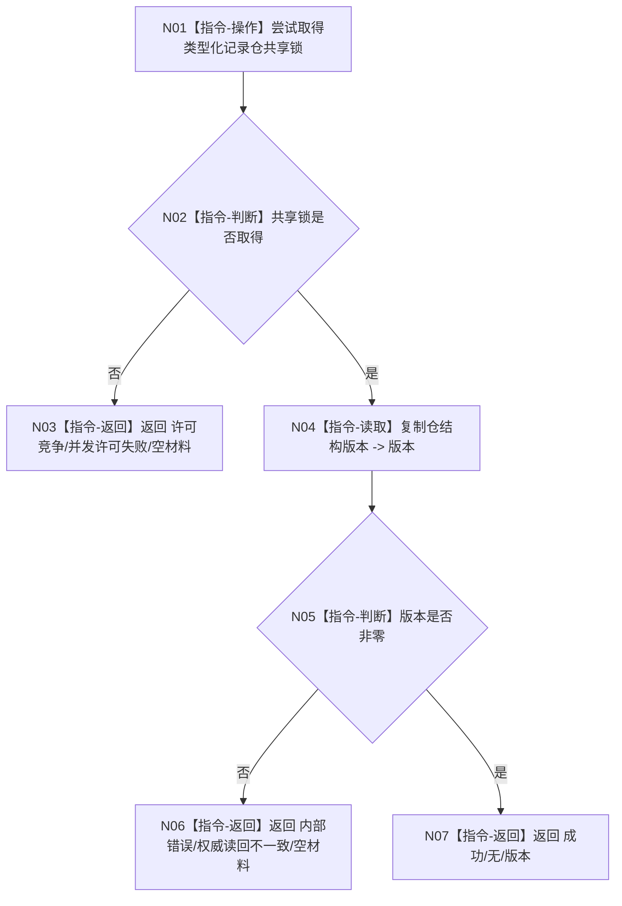

# F-A109 读取类型化记录仓结构版本

更新时间：2026-07-29

## 依据

```text
规范/2100_根规范_特征值_20260720.md
规范/4040_子规范_节点直接结构与领域记录同事务协议.md
规范/详细设计/NODE-TYPED-MIGRATION_NT-P2A_特征值类型化记录与当前关系迁移详细设计.md
```

## 身份与边界

本图是待新增函数的正式单函数施工流程图。它只取得类型化记录仓共享锁并回显已发布结构版本，不读取或返回任何记录。

## 函数合同

```text
根函数：
合同单项结果<std::uint64_t>
特征值类型化记录只读访问器::读取结构版本() const

归属模块 / 文件 / 层级：
海中鱼巣.领域.参与者.特征值类型化记录
海中鱼巣/领域/参与者.特征值类型化记录.ixx
public read-only 成员函数

参数：无。
返回：
成功/无/非零结构版本；
许可竞争/并发许可失败/空材料；
内部错误/权威读回不一致/空材料。
```

## 流程图



## 节点合同

| 节点 | 类型 | 参数 / 输入绑定 | 结果 / 输出绑定 | 事实读写 | 后继条件 | 验证 |
| --- | --- | --- | --- | --- | --- | --- |
| N01 | 指令-操作 | 仓共享锁 | 锁取得结果 | 只读锁 | 完成 | A17 |
| N04 | 指令-读取 | 仓结构版本 | `版本` | 只读仓 | 完成 | A17 |
| N03/N06/N07 | 指令-返回 | 具名分类 | 完整结果 | 无 | 终止 | A17 |

## 关键边界

```text
F-R102 在取得一次节点直接结构读取许可后先调用本函数固定记录仓版本；
随后每个 F-A106 读回版本必须等于该固定版本，否则返回读取版本漂移。
宿主合法空槽时仍以本函数的非零版本形成合法空组，不得使用0或隐式最新。
```
