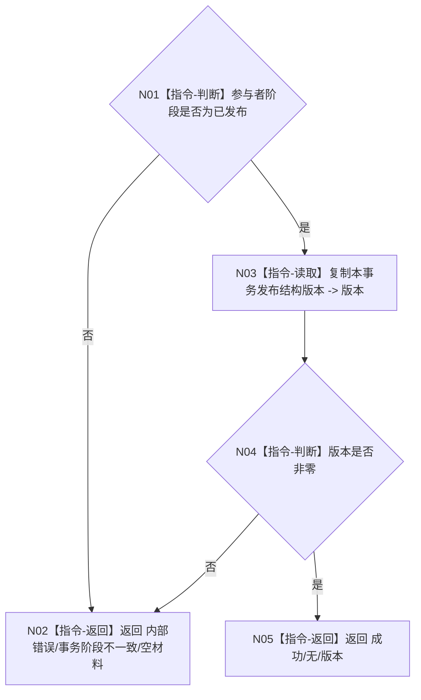

# F-A110 读取本事务发布结构版本

更新时间：2026-07-29

## 身份与边界

正式待新增单函数施工流程图。函数只读取记录参与者在 F-A104 最后发布时保存的本事务版本，不读取仓当前版本。

## 函数合同

```text
根函数：
合同单项结果<std::uint64_t>
特征值类型化记录事务参与者::读取本事务发布结构版本() const noexcept

归属：
海中鱼巣.领域.参与者.特征值类型化记录
海中鱼巣/领域/参与者.特征值类型化记录.ixx
public post-commit read-only 成员

参数：无。
返回：已发布且版本非零时成功/无/版本；其它阶段内部错误/事务阶段不一致/空材料。
```

## 流程图



## 关键边界

```text
本函数 noexcept、无锁、无分配；只能在普通执行器返回已提交后、参与者析构前调用。
后继并发事务即使推进仓当前版本，本函数仍回显本事务确切发布版本。
```
