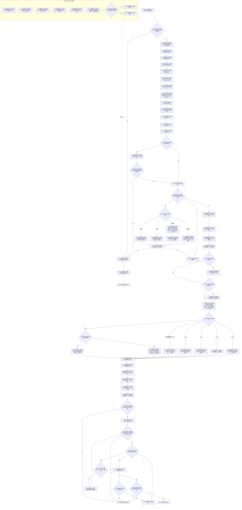

# F-A201 执行类型化记录专项子检查单函数施工流程图

更新时间：2026-07-29

## 函数合同

```text
根函数：bool 执行类型化记录专项子检查(
    类型化记录专项子检查编号 编号,
    const 完整正式关系准入表& 准入表) noexcept
归属：海中鱼巣.领域.自检.节点直接特征值类型化记录 /
海中鱼巣/领域/自检.节点直接特征值类型化记录.ixx / module-private
参数：编号按值；准入表调用期只读借用且必须完整。
返回：该固定子检查结果、预期字段和全部前后快照一致返回 true；否则 false。
调用方：仅 F-A108。
```

## 流程图



## 关键边界

编号先在 8.4 固定表中查到唯一描述；描述冻结目标根、完整 aggregate 输入、可选注入、参与者 span 配方、前态动作和逐字段预期。记录参与者甲、乙和探针均由本函数构造：A08 固定 span 为 `{&记录参与者甲,&固定失败探针参与者}`，A09 固定为 `{&记录参与者甲,&记录参与者乙}`，其它执行器子项固定为 `{&记录参与者甲}`。一个 F-A201 调用只执行一个子检查。需要本会话候选的用例在对应执行器回调内逐条调用 F-A101，不把候选跨事务保存。节点快照唯一调用当前真实 `导出权威状态()` 并逐字段比较 `节点直接身份仓库权威材料`；异常和正常路径均清除注入状态。
