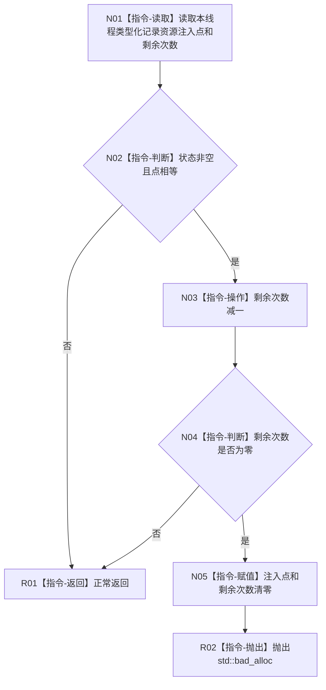

# F-A202 命中类型化记录资源失败注入单函数施工流程图

- 根函数：`void 命中类型化记录资源失败注入(std::uint16_t 注入点)`
- 物理位置：`海中鱼巣/领域/参与者.特征值类型化记录.ixx`，module-private，专项宏开启
- 返回：正常不带值返回；精确末次命中先清除状态再抛 `std::bad_alloc`

```mermaid
flowchart TD
 N01["N01【指令-读取】读取本线程类型化记录资源注入点和剩余次数"] --> N02{"N02【指令-判断】状态非空且点相等"}
 N02 -- 否 --> R01["R01【指令-返回】正常返回"]
 N02 -- 是 --> N03["N03【指令-操作】剩余次数减一"]
 N03 --> N04{"N04【指令-判断】剩余次数是否为零"}
 N04 -- 否 --> R01
 N04 -- 是 --> N05["N05【指令-赋值】注入点和剩余次数清零"]
 N05 --> R02["R02【指令-抛出】抛出std::bad_alloc"]
```
