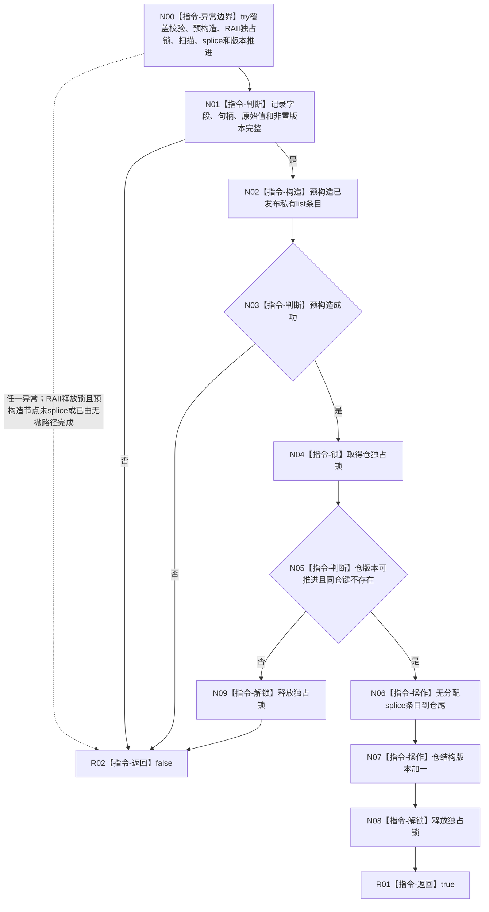

# F-A203 专项追加已发布类型化记录并推进版本单函数施工流程图

- 根函数：`bool 专项追加已发布类型化记录并推进版本(特征值类型化记录仓& 仓, const 特征值类型化记录& 记录) noexcept`
- 物理位置：`海中鱼巣/领域/参与者.特征值类型化记录.ixx`，专项宏开启 export
- 返回：完整插入并推进一次版本为 true；其它情况 false 且仓保持前态

