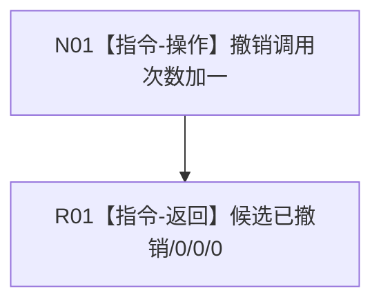

# F-A207 固定失败专项探针完成撤销单函数施工流程图

- 根函数：`节点直接身份结构写入结果 固定失败专项探针参与者::完成撤销()`
- 物理位置：`海中鱼巣/领域/自检.节点直接特征值类型化记录.ixx`，module-private override

```mermaid
flowchart TD
 N01["N01【指令-操作】撤销调用次数加一"] --> R01["R01【指令-返回】候选已撤销/0/0/0"]
```
