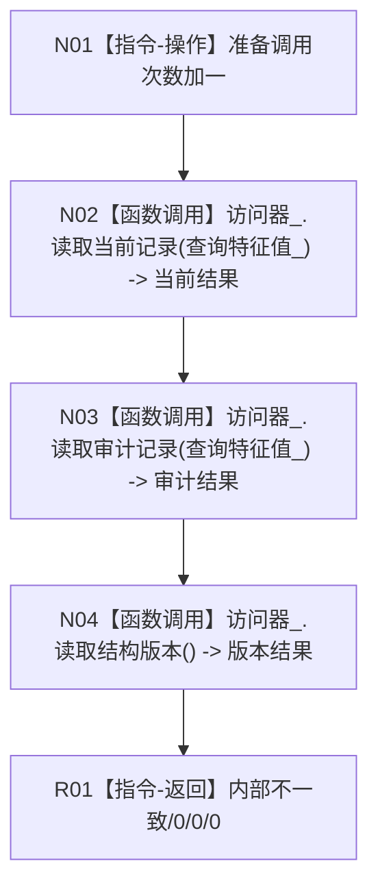

# F-A208 类型化记录读取专项探针准备提交单函数施工流程图

- 根函数：`节点直接身份结构写入结果 类型化记录读取专项探针参与者::准备提交(const 节点直接身份结构提交准备只读视图&)`
- 物理位置：`海中鱼巣/领域/自检.节点直接特征值类型化记录.ixx`，module-private override

```mermaid
flowchart TD
 N01["N01【指令-操作】准备调用次数加一"] --> N02["N02【函数调用】访问器_.读取当前记录(查询特征值_) -> 当前结果"]
 N02 --> N03["N03【函数调用】访问器_.读取审计记录(查询特征值_) -> 审计结果"]
 N03 --> N04["N04【函数调用】访问器_.读取结构版本() -> 版本结果"]
 N04 --> R01["R01【指令-返回】内部不一致/0/0/0"]
```
