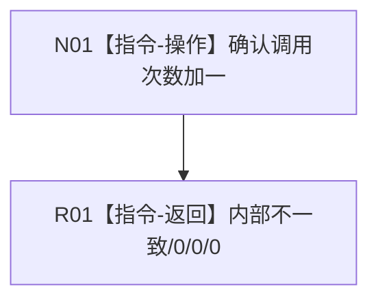

# F-A209 类型化记录读取专项探针确认待发布单函数施工流程图

- 根函数：`节点直接身份结构写入结果 类型化记录读取专项探针参与者::确认待发布()`
- 物理位置：`海中鱼巣/领域/自检.节点直接特征值类型化记录.ixx`，module-private override

```mermaid
flowchart TD
 N01["N01【指令-操作】确认调用次数加一"] --> R01["R01【指令-返回】内部不一致/0/0/0"]
```
