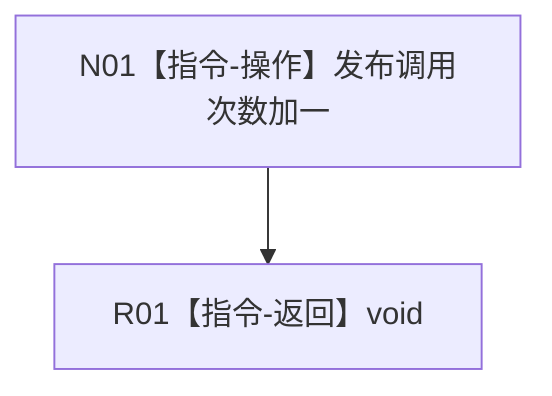

# F-A210 类型化记录读取专项探针完成发布单函数施工流程图

- 根函数：`void 类型化记录读取专项探针参与者::完成发布() noexcept`
- 物理位置：`海中鱼巣/领域/自检.节点直接特征值类型化记录.ixx`，module-private override

```mermaid
flowchart TD
 N01["N01【指令-操作】发布调用次数加一"] --> R01["R01【指令-返回】void"]
```
