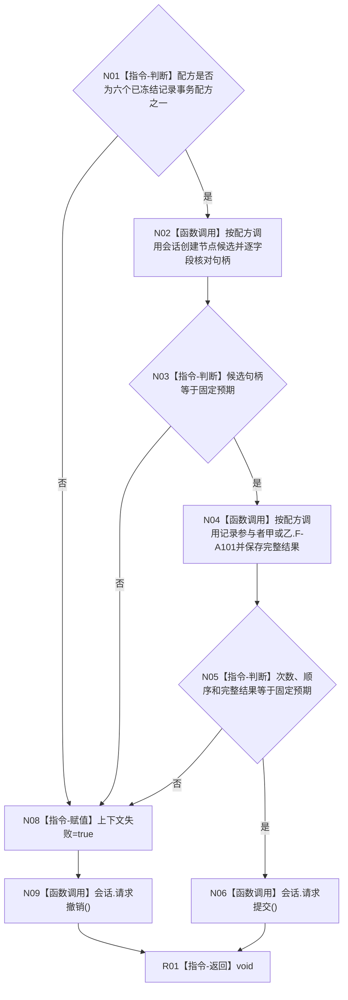

# F-A212 执行类型化记录专项事务回调单函数施工流程图

- 根函数：`void 执行类型化记录专项事务回调(专项回调配方 配方, 类型化记录专项执行上下文& 上下文, 节点直接身份结构写入会话& 会话)`
- 物理位置：`海中鱼巣/领域/自检.节点直接特征值类型化记录.ixx`，module-private

```mermaid
flowchart TD
 N01{"N01【指令-判断】配方是否为六个已冻结记录事务配方之一"} -->|否| N08["N08【指令-赋值】上下文失败=true"]
 N01 -->|是| N02["N02【函数调用】按配方调用会话创建节点候选并逐字段核对句柄"]
 N02 --> N03{"N03【指令-判断】候选句柄等于固定预期"}
 N03 -->|否| N08
 N03 -->|是| N04["N04【函数调用】按配方调用记录参与者甲或乙.F-A101并保存完整结果"]
 N04 --> N05{"N05【指令-判断】次数、顺序和完整结果等于固定预期"}
 N05 -->|否| N08
 N05 -->|是| N06["N06【函数调用】会话.请求提交()"]
 N06 --> R01["R01【指令-返回】void"]
 N08 --> N09["N09【函数调用】会话.请求撤销()"]
 N09 --> R01
```
