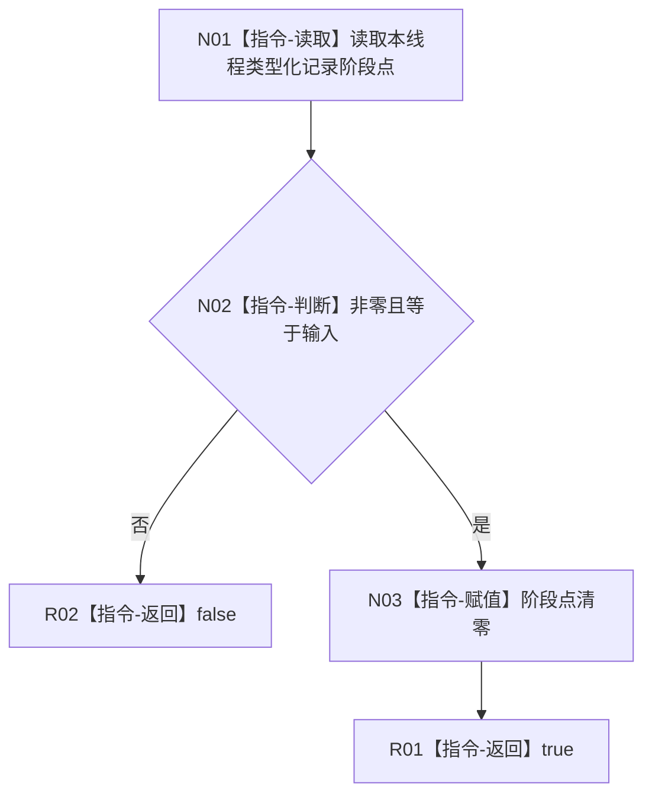

# F-A213 命中类型化记录阶段失败注入单函数施工流程图

- 根函数：`bool 命中类型化记录阶段失败注入(std::uint16_t 阶段点) noexcept`
- 物理位置：`海中鱼巣/领域/参与者.特征值类型化记录.ixx`，module-private，专项宏开启

```mermaid
flowchart TD
 N01["N01【指令-读取】读取本线程类型化记录阶段点"] --> N02{"N02【指令-判断】非零且等于输入"}
 N02 -->|否| R02["R02【指令-返回】false"]
 N02 -->|是| N03["N03【指令-赋值】阶段点清零"]
 N03 --> R01["R01【指令-返回】true"]
```
