# F-R101 复核特征值归属单函数施工流程图

更新时间：2026-07-29

## 函数合同

```text
根函数：
特征值归属读取结果
节点直接特征查询退役数据操作::复核特征值归属(
    节点句柄 目标特征值,
    std::optional<节点句柄> 预期抽象特征定义,
    特征值归属读取口径 口径,
    std::optional<std::uint64_t> 目标原始值版本) const

归属：海中鱼巣.领域.数据操作.节点直接特征查询退役 /
海中鱼巣/领域/数据操作.节点直接特征查询退役.ixx / public const
参数：两个句柄值式输入；可选定义只有具名不适用时为空；口径仅当前或历史审计。
返回：成功携带唯一完整归属材料；无关系链为合法未找到；许可、版本或结构异常零材料。
```

## 流程图

```mermaid
flowchart TD
    N00["N00【指令-异常边界】try 执行以下全部读取、归并、筛选和结果构造"] --> X01["X01【函数调用】F-R302(1)"]
    X01 --> N01{"N01【指令-判断】目标值/可选定义完整、口径受支持，当前口径版本参数为空且历史口径版本参数非零"}
    N00 -. 捕获 std::bad_alloc/等价资源异常 .-> ER["ER【指令-返回】返回 内部错误/资源失败/空材料"]
    N01 -- 否 --> N02["N02【指令-返回】返回 入口拒绝/精确原因/空材料"]
    N01 -- 是 --> N03["N03【函数调用】事务域_.取得读取许可() -> 结构读取许可"]
    N03 --> N04{"N04【指令-判断】结构读取许可是否有效"}
    N04 -- 否 --> N05["N05【指令-返回】返回 许可竞争/并发许可失败/空材料"]
    N04 -- 是 --> N06["N06【函数调用】节点仓_.读取节点审计(目标特征值) -> 值节点审计"]
    N06 --> N07{"N07【指令-判断】值节点存在、类型=特征值且状态符合口径"}
    N07 -- 否 --> N08["N08【指令-返回】返回 合法未找到或入口拒绝/精确原因/空材料"]
    N07 -- 是 --> N09["N09【函数调用】记录访问器_.读取结构版本() -> 固定记录仓版本结果"]
    N09 --> N10{"N10【指令-判断】固定版本结果是否成功且材料非零"}
    N10 -- 否 --> N11["N11【指令-返回】按许可竞争或内部错误返回空材料"]
    N10 -- 是 --> N12["N12【函数调用】关系仓_.读取全部关系审计() -> 全关系审计副本"]
    N12 --> N13["N13【指令-赋值】关系位置=0、最高版本关系表置空、结构错误=false"]
    N13 --> N13A{"N13A【指令-判断】关系位置是否等于全关系审计.size()"}
    N13A -- 否 --> N13B["N13B【指令-借用】当前关系=全关系审计[关系位置]"]
    N13B --> N13C["N13C【指令-操作】按当前关系编号查表；同版本置结构错误，更高版本替换，不存在则追加"]
    N13C --> N13D["N13D【指令-推进】关系位置加一"]
    N13D --> N13A
    N13A -- 是 --> N14{"N14【指令-判断】结构错误或最高版本关系表存在断裂记录"}
    N14 -- 是 --> N15["N15【指令-返回】返回 内部错误/权威读回不一致/空材料"]
    N14 -- 否 --> N16["N16【指令-赋值】关系位置=0、角色3关系链置空"]
    N16 --> N16A{"N16A【指令-判断】关系位置是否等于最高版本关系表.size()"}
    N16A -- 否 --> N16B["N16B【指令-借用】当前关系=最高版本关系表[关系位置]"]
    N16B --> N16C{"N16C【指令-判断】当前关系目标=目标值、类型22、顺序3且状态符合口径"}
    N16C -- 是 --> N16D["N16D【指令-操作】把当前关系追加到角色3关系链"]
    N16C -- 否 --> N16E["N16E【指令-推进】关系位置加一"]
    N16D --> N16E
    N16E --> N16A
    N16A -- 是 --> N17{"N17【指令-判断】角色3关系链数量"}
    N17 -- 0 --> N18["N18【指令-返回】返回 合法未找到/无/空材料"]
    N17 -- 多条 --> N19["N19【指令-返回】返回 内部错误/基数不满足/空材料"]
    N17 -- 1 --> N20["N20【指令-赋值】实例槽=唯一角色3关系源节点"]
    N20 --> N21["N21【函数调用】节点仓_.读取节点审计(实例槽) -> 槽节点审计"]
    N21 --> N22{"N22【指令-判断】槽节点类型=特征且命名域=实例特征槽身份"}
    N22 -- 否 --> N15
    N22 -- 是 --> N22A["N22A【指令-赋值】关系位置=0、宿主关系链置空"]
    N22A --> N22A1{"N22A1【指令-判断】关系位置是否等于最高版本关系表.size()"}
    N22A1 -- 否 --> N22A2["N22A2【指令-借用】当前关系=最高版本关系表[关系位置]"]
    N22A2 --> N22A3{"N22A3【指令-判断】当前关系目标=实例槽、类型22、顺序1且状态符合口径"}
    N22A3 -- 是 --> N22A4["N22A4【指令-操作】把当前关系追加到宿主关系链"]
    N22A3 -- 否 --> N22A5["N22A5【指令-推进】关系位置加一"]
    N22A4 --> N22A5
    N22A5 --> N22A1
    N22A1 -- 是 --> N22B{"N22B【指令-判断】宿主关系链是否恰一条"}
    N22B -- 否 --> N19
    N22B -- 是 --> N22C["N22C【指令-赋值】宿主=唯一角色1关系源节点"]
    N22C --> N22D["N22D【函数调用】节点仓_.读取节点审计(宿主) -> 宿主节点审计"]
    N22D --> N22E{"N22E【指令-判断】宿主有效且类型属于五种允许宿主"}
    N22E -- 否 --> N15
    N22E -- 是 --> N23["N23【指令-赋值】关系位置=0、角色2关系链置空"]
    N23 --> N23A{"N23A【指令-判断】关系位置是否等于最高版本关系表.size()"}
    N23A -- 否 --> N23B["N23B【指令-借用】当前关系=最高版本关系表[关系位置]"]
    N23B --> N23C{"N23C【指令-判断】当前关系源=实例槽、类型22、顺序2且状态符合口径"}
    N23C -- 是 --> N23D["N23D【指令-操作】把当前关系追加到角色2关系链"]
    N23C -- 否 --> N23E["N23E【指令-推进】关系位置加一"]
    N23D --> N23E
    N23E --> N23A
    N23A -- 是 --> N24{"N24【指令-判断】角色2关系链是否恰一条"}
    N24 -- 否 --> N19
    N24 -- 是 --> N25["N25【指令-赋值】抽象定义=唯一角色2关系目标节点"]
    N25 --> N26["N26【函数调用】节点仓_.读取节点审计(抽象定义) -> 定义节点审计"]
    N26 --> N27{"N27【指令-判断】定义节点类型=特征且命名域=抽象特征定义身份"}
    N27 -- 否 --> N15
    N27 -- 是 --> N27A["N27A【指令-赋值】角色1位置=0、同宿主同定义组合数量=0、唯一组合槽=空"]
    N27A --> N27A1{"N27A1【指令-判断】角色1位置是否等于最高版本关系表.size()"}
    N27A1 -- 否 --> N27A2["N27A2【指令-借用】候选角色1=最高版本关系表[角色1位置]"]
    N27A2 --> N27A3{"N27A3【指令-判断】候选角色1有效、类型22、顺序1且源=宿主"}
    N27A3 -- 否 --> N27A6["N27A6【指令-推进】角色1位置加一"]
    N27A3 -- 是 --> N27A4["N27A4【指令-赋值】定义关系位置=0、匹配定义关系数量=0"]
    N27A4 --> N27A4A{"N27A4A【指令-判断】定义关系位置是否等于最高版本关系表.size()"}
    N27A4A -- 否 --> N27A4B["N27A4B【指令-借用】定义候选=最高版本关系表[定义关系位置]"]
    N27A4B --> N27A4C{"N27A4C【指令-判断】定义候选有效、类型22、顺序2、源=候选槽、目标=抽象定义"}
    N27A4C -- 是 --> N27A4D["N27A4D【指令-操作】匹配定义关系数量加一"]
    N27A4C -- 否 --> N27A4E["N27A4E【指令-推进】定义关系位置加一"]
    N27A4D --> N27A4E
    N27A4E --> N27A4A
    N27A4A -- 是 --> N27A5{"N27A5【指令-判断】匹配定义关系数量是否恰一"}
    N27A5 -- 是 --> N27A7["N27A7【指令-操作】组合数量加一并保存唯一组合槽"]
    N27A5 -- 否 --> N27A6
    N27A7 --> N27A6
    N27A6 --> N27A1
    N27A1 -- 是 --> N27B{"N27B【指令-判断】组合数量是否恰一且唯一组合槽=实例槽"}
    N27B -- 否 --> N19
    N27B -- 是 --> N28{"N28【指令-判断】可选预期定义为空或等于抽象定义"}
    N28 -- 否 --> N29["N29【指令-返回】返回 合法未找到/值归属不一致/空材料"]
    N28 -- 是 --> N30{"N30【指令-判断】口径是否为当前"}
    N30 -- 是 --> N31["N31【函数调用】记录访问器_.读取当前记录(目标特征值) -> 当前记录结果"]
    N30 -- 否 --> N32["N32【函数调用】记录访问器_.读取审计记录(目标特征值) -> 审计记录结果"]
    N31 --> N33{"N33【指令-判断】当前记录成功且读取版本=固定版本"}
    N33 -- 否 --> N34["N34【指令-返回】返回 读取版本漂移或内部错误/空材料"]
    N33 -- 是 --> N36["N36【指令-赋值】目标类型化记录=当前唯一记录"]
    N32 --> N35{"N35【指令-判断】审计记录成功、读取版本=固定版本且目标原始值版本在历史组中恰一命中"}
    N35 -- 否 --> N34
    N35 -- 是 --> N36
    N36 --> N37["N37【函数调用】记录访问器_.读取结构版本() -> 末次记录仓版本结果"]
    N37 --> N38{"N38【指令-判断】末次版本成功且等于固定版本"}
    N38 -- 否 --> N34
    N38 -- 是 --> N39["N39【指令-构造】投影节点版本、原始记录、宿主、角色1/2/3关系为自有归属材料"]
    N39 --> N40{"N40【指令-判断】材料构造是否成功"}
    N40 -- 否 --> N41["N41【指令-返回】返回 内部错误/资源失败/空材料"]
    N40 -- 是 --> N42["N42【指令-返回】返回 成功/无/完整归属材料"]
```



## 关键边界

```text
当前口径只接受每个关系编号最高版本为有效的角色2/3且目标原始值版本参数必须为空；历史口径可接受已失效链，但必须显式传一个非零目标原始值版本并从 F-A107 历史组恰一选择。
关系仓审计中的同一关系历史版本先按关系编号归并，不能把同一失效链误计为多个归属。
记录仓与核心结构域不是同一把锁，因此先用 F-A109 固定版本、每次记录读取核对版本、返回前再调用 F-A109 复核。
角色1反向宿主必须恰一且宿主属于五种允许类型；同宿主+同抽象定义当前只能有一个实例槽。任何无/多宿主、多槽、多定义、重复关系版本或记录版本漂移均零材料。
```
