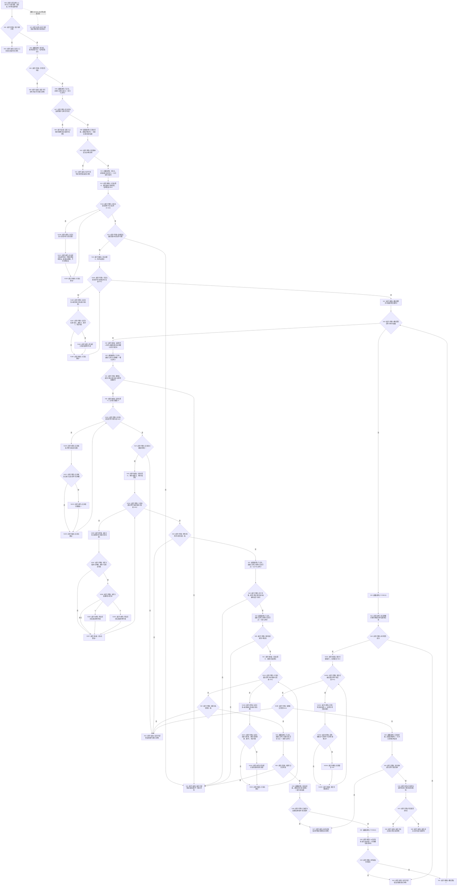

# F-R102 读取宿主实例特征槽位组单函数施工流程图

更新时间：2026-07-29

## 函数合同

```text
根函数：
宿主实例特征槽位组读取结果
节点直接特征查询退役数据操作::读取宿主实例特征槽位组(
    节点句柄 宿主) const

归属：海中鱼巣.领域.数据操作.节点直接特征查询退役 /
海中鱼巣/领域/数据操作.节点直接特征查询退役.ixx / public const
参数：宿主完整句柄；类型必须属于存在、场景、需求、任务、方法。
返回：非空组为成功；合法无槽为携带宿主和非零版本的合法空组；异常零材料。
```

## 流程图



## 关键边界

```text
F-A109 必须在枚举前固定版本，所有 F-A106 结果都必须等于该版本，返回前再以 F-A109 复核。
合法无槽仍返回具名材料和非零读取结构版本；其它失败不返回部分槽。
关系组使用一次核心结构读取许可下的全审计自有副本；记录仓通过版本前后夹取检测并发变化。
```
