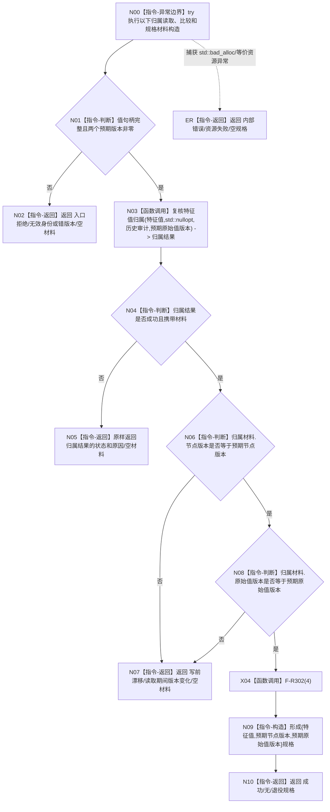

# F-R103 形成特征值退役规格单函数施工流程图

更新时间：2026-07-29

## 函数合同

```text
根函数：
特征值退役规格结果
节点直接特征查询退役数据操作::形成特征值退役规格(
    节点句柄 特征值,
    std::uint32_t 预期节点版本,
    std::uint64_t 预期原始值版本) const

归属：海中鱼巣.领域.数据操作.节点直接特征查询退役 /
海中鱼巣/领域/数据操作.节点直接特征查询退役.ixx / public const
参数：完整值句柄和两个非零预期版本。
返回：成功规格、原样传播的读取失败，或写前漂移；不携带仓、参与者或删除权。
```

## 流程图



## 关键边界

```text
本函数只通过一次 F-R101 调用取得读取许可和完整历史归属，不自行取得第二次许可。
合法未找到、许可竞争、读取版本漂移和内部错误均原样传播且材料为空。
```
