# F-R104 读取特征值退役材料单函数施工流程图

更新时间：2026-07-29

## 函数合同

```text
根函数：
带值读取结果<特征值退役材料>
节点直接特征查询退役数据操作::读取特征值退役材料(
    节点句柄 特征值) const

归属：海中鱼巣.领域.数据操作.节点直接特征查询退役 /
海中鱼巣/领域/数据操作.节点直接特征查询退役.ixx / public const
参数：特征值完整句柄。
返回：成功携带节点、唯一类型化记录、全部关系22/来源审计和全部本域批次引用；异常零材料。
```

## 流程图

```mermaid
flowchart TD
    N00["N00【指令-异常边界】try 执行以下全部读取、筛选、互证、排序和结果构造"] --> X05["X05【函数调用】F-R302(5)"]
    X05 --> N01{"N01【指令-判断】特征值句柄是否完整"}
    N00 -. 捕获 std::bad_alloc/等价资源异常 .-> ER["ER【指令-返回】返回 内部错误/资源失败/空材料"]
    N01 -- 否 --> N02["N02【指令-返回】返回 入口拒绝/无效身份/空材料"]
    N01 -- 是 --> N03["N03【函数调用】事务域_.取得读取许可() -> 结构读取许可"]
    N03 --> N04{"N04【指令-判断】许可是否有效"}
    N04 -- 否 --> N05["N05【指令-返回】返回 许可竞争/并发许可失败/空材料"]
    N04 -- 是 --> N06["N06【函数调用】节点仓_.读取节点审计(特征值) -> 值节点审计"]
    N06 --> N07{"N07【指令-判断】节点存在且类型=特征值"}
    N07 -- 否 --> N08["N08【指令-返回】返回 合法未找到或入口拒绝/精确原因/空材料"]
    N07 -- 是 --> N09["N09【函数调用】记录访问器_.读取结构版本() -> 固定记录仓版本结果"]
    N09 --> N10{"N10【指令-判断】固定版本成功且材料非零"}
    N10 -- 否 --> N11["N11【指令-返回】按许可竞争或内部错误返回空材料"]
    N10 -- 是 --> N12["N12【函数调用】记录访问器_.读取审计记录(特征值) -> 记录审计结果"]
    N12 --> N13{"N13【指令-判断】记录审计成功、历史组非空、按原始值版本严格升序且版本=固定版本"}
    N13 -- 否 --> N14["N14【指令-返回】返回 读取版本漂移或内部错误/空材料"]
    N13 -- 是 --> N15["N15【函数调用】关系仓_.读取全部关系审计() -> 全关系审计副本"]
    N15 --> N16["N16【指令-赋值】关系位置=0、关系22组置空、来源关系组置空、结构错误=false"]
    N16 --> N16A{"N16A【指令-判断】关系位置是否等于全关系审计.size()"}
    N16A -- 否 --> N16B["N16B【指令-借用】当前关系=全关系审计[关系位置]"]
    N16B --> N16C{"N16C【指令-判断】当前关系类型22、顺序3且目标=特征值"}
    N16C -- 是 --> N16D["N16D【指令-操作】把当前关系追加到关系22组"]
    N16C -- 否 --> N17{"N17【指令-判断】当前关系类型=因果来源、顺序1且源=特征值"}
    N17 -- 是 --> N17A["N17A【指令-操作】把当前关系追加到来源关系组"]
    N17 -- 否 --> N17B["N17B【指令-推进】关系位置加一"]
    N16D --> N17B
    N17A --> N17B
    N17B --> N16A
    N16A -- 是 --> N18{"N18【指令-判断】两组关系无重复编号+版本、同编号端点不漂移且状态受支持"}
    N18 -- 否 --> N19["N19【指令-返回】返回 内部错误/权威读回不一致/空材料"]
    N18 -- 是 --> N20["N20【函数调用】批次访问器_.读取特征值批次引用组(特征值) -> 批次引用结果"]
    N20 --> N21{"N21【指令-判断】批次引用结果是否为成功或合法空组且版本非零"}
    N21 -- 否 --> N22["N22【指令-返回】原样映射许可竞争、资源失败或内部错误/空材料"]
    N21 -- 是 --> N23A["N23A【指令-赋值】批次引用位置=0"]
    N23A --> N24{"N24【指令-判断】批次引用位置是否等于结果组大小"}
    N24 -- 是 --> N35["N35【函数调用】记录访问器_.读取结构版本() -> 末次记录仓版本结果"]
    N24 -- 否 --> N23B["N23B【指令-借用】当前引用=结果组[批次引用位置]"]
    N23B --> N25{"N25【指令-判断】输入值在当前引用中恰为新特征值或恰为写前当前值"}
    N25 -- 否或两者同时命中 --> N19
    N25 -- 新特征值角色 --> N25A{"N25A【指令-判断】发布后原始值版本是否在历史组中恰一命中"}
    N25A -- 否 --> N19
    N25A -- 是 --> N26["N26【指令-读取】按宿主关系完整句柄在全审计中精确匹配关系编号+版本"]
    N25 -- 写前当前值角色 --> N25B{"N25B【指令-判断】写前三元组完整且写前原始值版本在历史组中恰一命中"}
    N25B -- 否 --> N19
    N25B -- 是 --> N25C["N25C【指令-读取】按写前当前关系完整句柄在全审计中精确匹配关系编号+版本"]
    N25C --> N25D{"N25D【指令-判断】写前关系是否恰一、类型22顺序3、源=实例槽、目标=输入值且历史状态受支持"}
    N25D -- 否 --> N19
    N25D -- 是 --> N26
    N26 --> N27["N27【指令-读取】按定义关系完整句柄在全审计中精确匹配关系编号+版本"]
    N27 --> N28["N28【指令-读取】按发布后当前关系完整句柄在全审计中精确匹配关系编号+版本"]
    N28 --> N29["N29【指令-读取】按来源关系完整句柄在全审计中精确匹配关系编号+版本"]
    N29 --> N30{"N30【指令-判断】四次匹配各恰一且类型、顺序、端点与引用逐字段一致"}
    N30 -- 否 --> N19
    N30 -- 是 --> N31["N31【函数调用】批次访问器_.读取批次记录(引用.批次身份) -> 批次记录结果"]
    N31 --> N32{"N32【指令-判断】记录成功且同顺序项目逐字段等于当前引用"}
    N32 -- 否 --> N19
    N32 -- 是 --> N23C["N23C【指令-推进】批次引用位置加一"]
    N23C --> N24
    N35 --> N36{"N36【指令-判断】末次记录仓版本成功且等于固定版本"}
    N36 -- 否 --> N14
    N36 -- 是 --> N37["N37【指令-异常边界】try 关系22组和来源组按关系编号、版本升序排序"]
    N37 --> N37A{"N37A【指令-判断】是否捕获 std::bad_alloc 或等价资源失败"}
    N37A -- 是 --> N40["N40【指令-返回】丢弃全部局部材料并返回 内部错误/资源失败/空材料"]
    N37A -- 否 --> X06["X06【函数调用】F-R302(6)"]
    X06 --> N38["N38【指令-异常边界】try 批次引用组按批次编号、项目顺序号升序排序"]
    N38 --> N39{"N39【指令-判断】是否捕获 std::bad_alloc 或等价资源失败"}
    N39 -- 是 --> N40
    N39 -- 否 --> X07["X07【函数调用】F-R302(7)"]
    X07 --> N41["N41【指令-异常边界】try 形成节点版本、完整原始值历史组和三组自有审计材料"]
    N41 --> N41A{"N41A【指令-判断】是否捕获 std::bad_alloc 或等价资源失败"}
    N41A -- 是 --> N40
    N41A -- 否 --> N42["N42【指令-返回】返回 成功/无/完整退役材料"]
```



## 关键边界

```text
F-W112 只按完整句柄读取本域批次账，节点类型由本函数在一次结构读取许可内用节点仓复核。
每条批次引用保存四个发布时关系句柄和发布后原始值版本；本函数必须逐句柄匹配历史审计，不调用当前槽读回。输入值若命中 `新特征值`，用发布后原始值版本互证；若命中 `写前当前值`，还必须用写前当前关系完整句柄和写前原始值版本互证。一个项目同时命中两个角色属于内部不一致。
批次引用合法空不阻止退役材料成功；退役材料携带 F-A107 的完整有序已发布历史组，每条批次引用按自身新值或写前版本在该组中恰一互证。关系和记录悬空、重复或版本漂移整体失败，不返回部分组。
```
