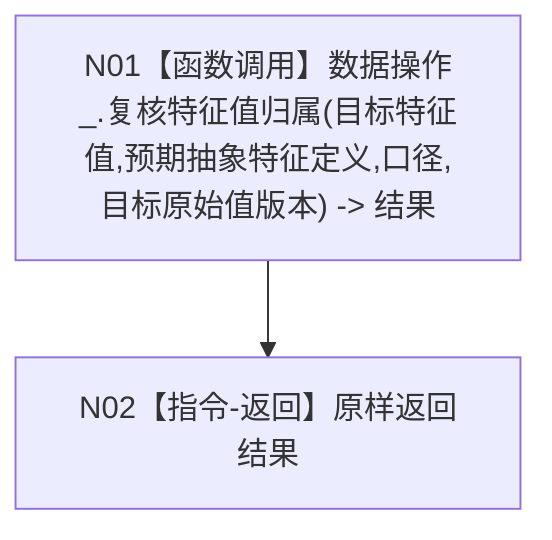

# F-R201 服务复核特征值归属

根函数：`特征值归属读取结果 节点直接特征服务::复核特征值归属(节点句柄 目标特征值, std::optional<节点句柄> 预期抽象特征定义, 特征值归属读取口径 口径, std::optional<std::uint64_t> 目标原始值版本) const`

归属：`海中鱼巣.领域.服务.节点直接特征` / `海中鱼巣/领域/服务.节点直接特征.ixx`；public const 成员。

节点合同：四个实参逐项绑定；不转换当前 / 历史口径、显式历史版本或错误分类。
