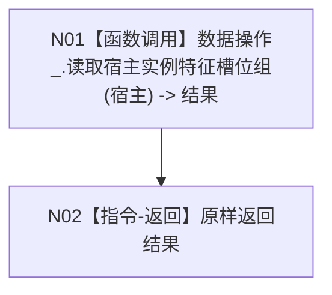

# F-R202 服务读取宿主实例特征槽位组

根函数：`宿主实例特征槽位组读取结果 节点直接特征服务::读取宿主实例特征槽位组(节点句柄 宿主) const`

归属：`海中鱼巣.领域.服务.节点直接特征` / `海中鱼巣/领域/服务.节点直接特征.ixx`；public const 成员。

```mermaid
flowchart TD
 N01["N01【函数调用】数据操作_.读取宿主实例特征槽位组(宿主) -> 结果"] --> N02["N02【指令-返回】原样返回结果"]
```

节点合同：合法空组的宿主和非零版本均原样保留；不补默认材料。
