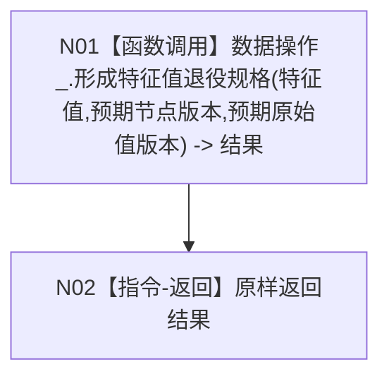

# F-R203 服务形成特征值退役规格

根函数：`特征值退役规格结果 节点直接特征服务::形成特征值退役规格(节点句柄 特征值, std::uint32_t 预期节点版本, std::uint64_t 预期原始值版本) const`

归属：`海中鱼巣.领域.服务.节点直接特征` / `海中鱼巣/领域/服务.节点直接特征.ixx`；public const 成员。

节点合同：两个版本均显式传递；不使用零版本或隐式最新。
