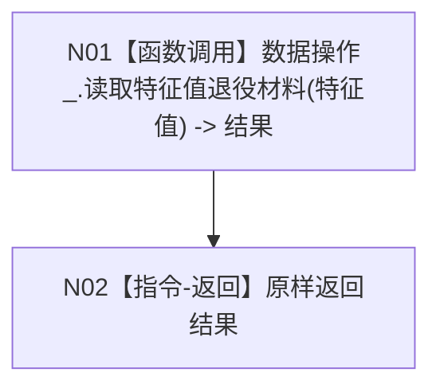

# F-R204 服务读取特征值退役材料

根函数：`带值读取结果<特征值退役材料> 节点直接特征服务::读取特征值退役材料(节点句柄 特征值) const`

归属：`海中鱼巣.领域.服务.节点直接特征` / `海中鱼巣/领域/服务.节点直接特征.ixx`；public const 成员。

```mermaid
flowchart TD
 N01["N01【函数调用】数据操作_.读取特征值退役材料(特征值) -> 结果"] --> N02["N02【指令-返回】原样返回结果"]
```

节点合同：不暴露仓、锁、许可或参与者；不把空引用组转换成未找到。
