# F-R301 执行跨域读取退役专项子检查单函数施工流程图

更新时间：2026-07-29

## 函数合同

```text
根函数：bool 执行跨域读取退役专项子检查(
    跨域读取退役专项子检查编号 编号,
    const 完整正式关系准入表& 准入表) noexcept
归属：海中鱼巣.领域.自检.节点直接特征查询退役 /
海中鱼巣/领域/自检.节点直接特征查询退役.ixx / module-private
参数：编号按值；准入表调用期只读借用且下标22已由F-W115替换。
返回：一个固定子检查全部结果和快照一致返回true，否则false。
调用方：仅F-R105。
```

## 流程图

```mermaid
flowchart TD
 N00["N00【指令-异常边界】try 执行一个固定子检查"] --> N01{"N01【指令-判断】编号在8.4的50项表内且准入表完整"}
 N00 -. "任一异常" .-> E01["E01【函数调用】清除类型化记录资源失败注入()"]
 E01 --> E02["E02【函数调用】清除类型化记录阶段失败注入()"]
 E02 --> E03["E03【函数调用】清除特征批次记录资源失败注入()"]
 E03 --> E04["E04【函数调用】清除特征批次记录阶段失败注入()"]
 E04 --> E05["E05【函数调用】清除特征写入资源失败注入()"]
 E05 --> E06["E06【函数调用】清除特征写入核心步骤失败注入()"]
 E06 --> E07["E07【函数调用】清除特征写入专项阶段回调()"]
 E07 --> E08["E08【函数调用】清除特征查询退役资源失败注入()"]
 E08 --> E09["E09【函数调用】清除特征查询退役专项阶段回调()"]
 E09 --> E10["E10【指令-返回】返回false"]
 N01 -- "否" --> E01
 N01 -- "是" --> N02["N02【指令-绑定】按编号从50项固定描述数组取得唯一 const 描述引用"]
 N02 --> C01["C01【函数调用】清除类型化记录资源失败注入()"]
 C01 --> C02["C02【函数调用】清除类型化记录阶段失败注入()"]
 C02 --> C03["C03【函数调用】清除特征批次记录资源失败注入()"]
 C03 --> C04["C04【函数调用】清除特征批次记录阶段失败注入()"]
 C04 --> C05["C05【函数调用】清除特征写入资源失败注入()"]
 C05 --> C06["C06【函数调用】清除特征写入核心步骤失败注入()"]
 C06 --> C07["C07【函数调用】清除特征写入专项阶段回调()"]
 C07 --> C08["C08【函数调用】清除特征查询退役资源失败注入()"]
 C08 --> C09["C09【函数调用】清除特征查询退役专项阶段回调()"]
 C09 --> F01["F01【指令-构造】事务域"]
 F01 --> F02["F02【指令-构造】节点仓{0x5032A001}"]
 F02 --> F03["F03【指令-构造】关系仓{节点仓,准入表,0x5032A002}"]
 F03 --> F04["F04【指令-构造】索引仓{节点仓,关系仓}"]
 F04 --> F05["F05【指令-构造】执行器{&事务域,&节点仓,&关系仓,&索引仓}"]
 F05 --> F06["F06【指令-构造】记录仓"]
 F06 --> F07["F07【指令-构造】批次仓"]
 F07 --> F08["F08【指令-构造】写数据操作{事务域,节点仓,关系仓,索引仓,记录仓,批次仓}"]
 F08 --> F09["F09【指令-构造】查询数据操作{事务域,节点仓,关系仓,记录仓,批次仓}"]
 F09 --> F10["F10【指令-构造】查询服务{查询数据操作}"]
 F10 --> F11["F11【指令-构造】记录访问器{记录仓}"]
 F11 --> F12["F12【指令-构造】批次访问器{批次仓}"]
 F12 --> B01["B01【函数调用】执行器.执行(本函数六基础节点回调) -> 基础结果"]
 B01 --> B02{"B02【指令-判断】基础结果和六完整句柄是否等于8.4"}
 B02 -- "否" --> E01
 B02 -- "是" --> P01["P01【指令-赋值】前态动作序号=0"]
 P01 --> P02{"P02【指令-判断】前态动作序号是否等于描述.前态动作组.size()"}
 P02 -- "否" --> P03{"P03【指令-判断】当前前态动作"}
 P03 -- "F-W101" --> P04["P04【函数调用】写数据操作.发布新实例槽位(动作.请求) -> 前态结果"]
 P03 -- "F-W102" --> P05["P05【函数调用】写数据操作.换代实例槽位当前值(动作.请求) -> 前态结果"]
 P03 -- "F-W104" --> P06["P06【函数调用】写数据操作.提交特征批次(动作.请求) -> 前态结果"]
 P03 -- "受控损坏条目" --> P07["P07【函数调用】专项插入特征批次仓夹具条目(批次仓,动作.记录,发布位,允许重复) -> 前态结果"]
 P04 --> P08
 P05 --> P08
 P06 --> P08
 P07 --> P08["P08【指令-判断】前态结果是否逐字段等于动作.预期"]
 P08 -- "否" --> E01
 P08 -- "是" --> P09["P09【指令-赋值】前态动作序号加一"]
 P09 --> P02
 P02 -- "是" --> S01["S01【函数调用】节点仓.导出权威状态() -> 前节点权威材料"]
 S01 --> S02["S02【函数调用】关系仓.读取全部关系审计() -> 前关系快照"]
 S02 --> S03["S03【函数调用】索引仓.导出可丢弃加速材料() -> 前索引快照"]
 S03 --> S04["S04【函数调用】记录访问器.读取结构版本() -> 前记录版本"]
 S04 --> S04A{"S04A【指令-判断】描述.快照批次身份是否有值"}
 S04A -- "是" --> S05["S05【函数调用】批次访问器.读取批次记录(*描述.快照批次身份) -> 前批次快照"]
 S04A -- "否" --> S05A["S05A【指令-赋值】前批次快照=nullopt"]
 S05A --> I01
 S05 --> I01{"I01【指令-判断】描述是否设置查询资源或阶段回调"}
 I01 -- "资源" --> I02["I02【函数调用】设置特征查询退役资源失败注入(描述.点,1)"]
 I01 -- "阶段回调" --> I03["I03【函数调用】设置特征查询退役专项阶段回调(1,&F-R303,&上下文)"]
 I01 -- "无" --> D01
 I02 --> D01
 I03 --> D01{"D01【指令-判断】描述.目标根"}
 D01 -- "F-R101" --> T01["T01【函数调用】查询数据操作.复核特征值归属(四实参) -> 目标结果"]
 D01 -- "F-R102" --> T02["T02【函数调用】查询数据操作.读取宿主实例特征槽位组(宿主) -> 目标结果"]
 D01 -- "F-R103" --> T03["T03【函数调用】查询数据操作.形成特征值退役规格(三实参) -> 目标结果"]
 D01 -- "F-R104" --> T04["T04【函数调用】查询数据操作.读取特征值退役材料(值) -> 目标结果"]
 D01 -- "F-R201" --> T05["T05【函数调用】查询服务.复核特征值归属(四实参) -> 目标结果"]
 D01 -- "F-R202" --> T06["T06【函数调用】查询服务.读取宿主实例特征槽位组(宿主) -> 目标结果"]
 D01 -- "F-R203" --> T07["T07【函数调用】查询服务.形成特征值退役规格(三实参) -> 目标结果"]
 D01 -- "F-R204" --> T08["T08【函数调用】查询服务.读取特征值退役材料(值) -> 目标结果"]
 T01 --> G01
 T02 --> G01
 T03 --> G01
 T04 --> G01
 T05 --> G01
 T06 --> G01
 T07 --> G01
 T08 --> G01["G01【指令-读取】读取可选阶段上下文.准备失败"]
 G01 --> D02["D02【函数调用】清除类型化记录资源失败注入()"]
 D02 --> D03["D03【函数调用】清除类型化记录阶段失败注入()"]
 D03 --> D04["D04【函数调用】清除特征批次记录资源失败注入()"]
 D04 --> D05["D05【函数调用】清除特征批次记录阶段失败注入()"]
 D05 --> D06["D06【函数调用】清除特征写入资源失败注入()"]
 D06 --> D07["D07【函数调用】清除特征写入核心步骤失败注入()"]
 D07 --> D08["D08【函数调用】清除特征写入专项阶段回调()"]
 D08 --> D09["D09【函数调用】清除特征查询退役资源失败注入()"]
 D09 --> D10["D10【函数调用】清除特征查询退役专项阶段回调()"]
 D10 --> S06["S06【函数调用】节点仓.导出权威状态() -> 后节点权威材料"]
 S06 --> S07["S07【函数调用】关系仓.读取全部关系审计() -> 后关系快照"]
 S07 --> S08["S08【函数调用】索引仓.导出可丢弃加速材料() -> 后索引快照"]
 S08 --> S09["S09【函数调用】记录访问器.读取结构版本() -> 后记录版本"]
 S09 --> S09A{"S09A【指令-判断】描述.快照批次身份是否有值"}
 S09A -- "是" --> S10["S10【函数调用】批次访问器.读取批次记录(*描述.快照批次身份) -> 后批次快照"]
 S09A -- "否" --> S10A["S10A【指令-赋值】后批次快照=nullopt"]
 S10A --> V01
 S10 --> V01{"V01【指令-判断】目标结果和阶段上下文标记逐字段等于预期"}
 V01 -- "否" --> R02["R02【指令-返回】返回false"]
 V01 -- "是" --> V02["V02【指令-赋值】材料种类=节点、向量位置=0"]
 V02 --> V03{"V03【指令-判断】当前前后材料标量字段与预期相等且向量大小相等"}
 V03 -- "否" --> R02
 V03 -- "是" --> V04{"V04【指令-判断】向量位置是否等于当前向量大小"}
 V04 -- "否" --> V05["V05【指令-借用】当前实际元素和预期元素"]
 V05 --> V06{"V06【指令-判断】元素全部字段递归相等"}
 V06 -- "否" --> R02
 V06 -- "是" --> V07["V07【指令-推进】向量位置加一"]
 V07 --> V04
 V04 -- "是" --> V08{"V08【指令-判断】是否已比较节点、关系、索引三类向量"}
 V08 -- "否" --> V09["V09【指令-推进】切换下一材料种类并把向量位置置0"]
 V09 --> V03
 V08 -- "是" --> V10{"V10【指令-判断】记录版本和optional批次前后存在性、值全部字段等于预期"}
 V10 -- "否" --> R02
 V10 -- "是" --> R01["R01【指令-返回】返回true"]

 subgraph CB["本函数六基础节点回调"]
  B11["B11【函数调用】会话.创建节点候选(场景,场景身份1) -> 宿主"] --> B12["B12【函数调用】会话.创建节点候选(特征,抽象特征定义身份1) -> 定义甲"]
  B12 --> B13["B13【函数调用】会话.创建节点候选(特征,抽象特征定义身份2) -> 定义乙"]
  B13 --> B14["B14【函数调用】会话.创建节点候选(状态,状态身份1) -> 来源甲"]
  B14 --> B15["B15【函数调用】会话.创建节点候选(状态,状态身份2) -> 来源乙"]
  B15 --> B16["B16【函数调用】会话.创建节点候选(特征,实例特征槽身份1) -> 错命名域特征"]
  B16 --> B17{"B17【指令-判断】六结果均为已形成候选且完整句柄逐字段等于8.4"}
  B17 -- "是" --> B18["B18【函数调用】会话.请求提交()"]
  B17 -- "否" --> B19["B19【函数调用】会话.请求撤销()"]
 end
```



## 关键边界

8.4 的50项固定描述逐项冻结前态动作、唯一 F-R/F-R2 根、四实参当前/历史口径、可选注入和预期；一个调用不遍历下一项。基础节点回调由本图 B11—B19 完整定义，不跨文档引用另一个函数的局部 subgraph。记录访问器和批次访问器分别在 F11/F12 由本函数仓引用构造；节点快照唯一调用当前真实 `导出权威状态()`。R05 中当前核心拒绝而不可构造的重复关系编号版本只比较其固定拒绝和静态不变量，不调用 F-R101；其余可构造子项才调用表中具名根。合法前态只经公开 F-W101/F-W102/F-W104 形成；只有受控损坏批次使用宏开夹具函数。
