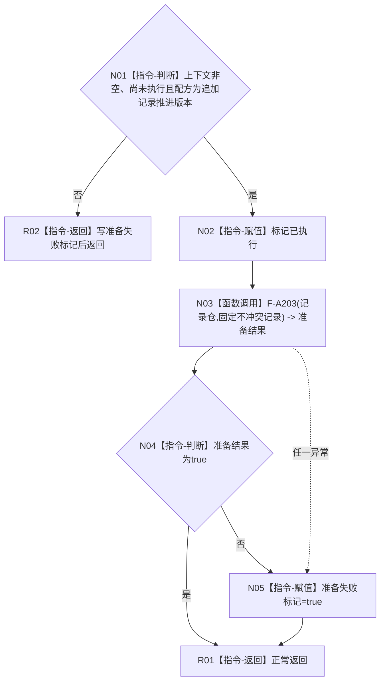

# F-R303 执行特征查询退役专项阶段回调单函数施工流程图

- 根函数：`void 执行特征查询退役专项阶段回调(void* 上下文) noexcept`
- 物理位置：`海中鱼巣/领域/自检.节点直接特征查询退役.ixx`，module-private

```mermaid
flowchart TD
 N01{"N01【指令-判断】上下文非空、尚未执行且配方为追加记录推进版本"} -->|否| R02["R02【指令-返回】写准备失败标记后返回"]
 N01 -->|是| N02["N02【指令-赋值】标记已执行"]
 N02 --> N03["N03【函数调用】F-A203(记录仓,固定不冲突记录) -> 准备结果"]
 N03 --> N04{"N04【指令-判断】准备结果为true"}
 N04 -->|否| N05["N05【指令-赋值】准备失败标记=true"]
 N04 -->|是| R01["R01【指令-返回】正常返回"]
 N05 --> R01
 N03 -. "任一异常" .-> N05
```
