# F-W101 发布新实例槽位

根函数：`带值结构写入结果<实例特征槽位值式材料> 节点直接特征写入数据操作::发布新实例槽位(const 新实例槽位发布请求& 请求)`

归属：`海中鱼巣.领域.数据操作.节点直接特征写入` / `海中鱼巣/领域/数据操作.节点直接特征写入.ixx`；待新增；请求仅调用期借用；结果自有。

```mermaid
flowchart TD
 N01{"N01【指令-判断】请求宿主、抽象定义、来源是否为有效完整句柄"} -- 否 --> N16["N16【指令-返回】入口拒绝/无效身份/空材料/版本0"]
 N01 -- 是 --> N17{"N17【指令-判断】两主键命名域和键值、三态原始值是否有效"} -- 否 --> N16
 N17 -- 是 --> P01["P01【函数调用】事务域_.取得读取许可() -> 事务外结构读取许可"]
 P01 --> P02{"P02【指令-判断】读取许可是否有效"}
 P02 -- 否 --> P05["P05【指令-返回】许可竞争/并发许可失败/空材料/版本0"]
 P02 -- 是 --> N25["N25【函数调用】节点仓.读取节点审计(请求.宿主) -> 宿主审计"]
 N25 --> N26["N26【函数调用】节点仓.读取节点审计(请求.抽象定义) -> 定义审计"]
 N26 --> N27["N27【函数调用】节点仓.读取节点审计(请求.来源) -> 来源审计"]
 N27 --> N28{"N28【指令-判断】宿主有效且类型允许、定义有效且命名域正确、来源有效"}
 N28 -- 否 --> N16
 N28 -- 是 --> N02["N02【函数调用】节点仓.读取稳定主键当前身份(实例槽主键) -> 槽身份"]
 N02 --> N03["N03【函数调用】节点仓.读取稳定主键当前身份(特征值主键) -> 值身份"]
 N03 --> N04{"N04【指令-判断】两项稳定主键当前身份状态组合"}
 N04 -- 两项当前有效 --> N05["N05【函数调用】F-W103 读取实例槽位当前材料(事务外结构读取许可, 槽身份.当前身份) -> 读回"]
 N05 --> N32{"N32【指令-判断】读回结果分类"}
 N32 -- 成功且材料/版本完整 --> N06{"N06【指令-判断】槽/值主键映射、宿主、定义、来源、原始值版本1和三态原始值均与请求逐字段相等"}
 N32 -- 合法未找到或成功但材料/版本不完整 --> N33["N33【指令-返回】返回 内部错误/权威读回不一致/空材料/版本0"]
 N32 -- 许可竞争/读取版本漂移/资源失败/其它内部错误 --> N32A["N32A【指令-返回】原样保留读回的状态与精确原因；材料空、版本0"]
 N06 -- 是 --> N29["N29【指令-返回】返回 幂等读回/无/读回材料/读回非零版本"]
 N06 -- 否 --> N07
 N04 -- 一项当前有效一项未占用/任一历史占用 --> N07["N07【指令-返回】返回入口拒绝/同键异义，材料空、版本0"]
 N04 -- 任一入口拒绝或内部不一致 --> N33
 N04 -- 两项未占用 --> N18["N18【函数调用】节点仓.读取命名域高水位(实例特征槽身份) -> 槽高水位"]
 N18 --> N19["N19【函数调用】节点仓.读取命名域高水位(特征值身份) -> 值高水位"]
 N19 --> N20{"N20【指令-判断】两请求键值是否分别等于对应高水位+1"} -- 否 --> N21["N21【指令-返回】入口拒绝/错版本/空材料/版本0"]
 N20 -- 是 --> N22["N22【函数调用】关系仓.读取全部关系审计() -> 写前关系审计组"]
 N22 --> N23["N23【指令-异常边界】try 构造关系编号到最高版本记录表"]
 N23 --> N23B["N23B【指令-赋值】最高版本记录位置=0且同定义槽计数=0"]
 N23B --> N23C{"N23C【指令-判断】位置是否等于最高版本记录数"}
 N23C -- 否 --> N23D{"N23D【指令-判断】当前记录是否为宿主到某实例槽的有效关系22角色1"}
 N23D -- 否 --> N23H
 N23D -- 是 --> N23E["N23E【指令-赋值】候选实例槽=当前记录.目标节点"]
 N23E --> N23F["N23F【指令-赋值】角色2位置=0、角色2基数=0"]
 N23F --> N23F1{"N23F1【指令-判断】角色2位置是否等于最高版本记录数"}
 N23F1 -- 否 --> N23F2["N23F2【指令-借用】角色2候选=最高版本表[角色2位置]"]
 N23F2 --> N23F3{"N23F3【指令-判断】候选有效、类型22、顺序2、源=候选实例槽、目标=请求抽象定义"}
 N23F3 -- 是 --> N23F4["N23F4【指令-操作】角色2基数加一"]
 N23F3 -- 否 --> N23F5["N23F5【指令-推进】角色2位置加一"]
 N23F4 --> N23F5
 N23F5 --> N23F1
 N23F1 -- 是 --> N23G{"N23G【指令-判断】角色2基数是否为0或1"}
 N23G -- 否 --> N24
 N23G -- 是 --> N23I{"N23I【指令-判断】角色2基数是否为1"}
 N23I -- 是 --> N23J["N23J【指令-赋值】同定义槽计数加一"]
 N23I -- 否 --> N23H
 N23J --> N23H["N23H【指令-赋值】最高版本记录位置加一"]
 N23H --> N23C
 N23C -- 是 --> N23A{"N23A【指令-判断】是否捕获 std::bad_alloc 或等价资源失败"}
 N23A -- 是 --> N31
 N23A -- 否 --> N24{"N24【指令-判断】复核分类"}
 N24 -- 已存在同宿主同定义槽 --> N07
 N24 -- 重复/断裂/角色悬空或多重 --> N33
 N24 -- 结构完整且未占用 --> P03["P03【指令-操作】释放事务外结构读取许可"]
 P03 --> N08["N08【指令-异常边界】try 构造记录参与者、回调领域失败、候选返回材料和参与者 span"]
 N08 --> N30{"N30【指令-判断】是否捕获 std::bad_alloc 或等价资源失败"}
 N30 -- 是 --> N31["N31【指令-返回】返回 内部错误/资源失败/空材料/版本0"]
 N30 -- 否 --> N09["N09【函数调用】执行器.执行(回调, span{记录参与者}) -> 核心结果"]
 subgraph CB["N09 回调内指令"]
  C00A["C00A【函数调用】会话.读取节点(请求.宿主) -> 锁内宿主"] --> C00B["C00B【函数调用】会话.读取节点(请求.抽象定义) -> 锁内定义"]
  C00B --> C00C["C00C【函数调用】会话.读取节点(请求.来源) -> 锁内来源"]
  C00C --> C00D{"C00D【指令-判断】三节点仍与写前审计逐字段相等且有效"}
  C00D -- 否 --> CF
  C00D -- 是 --> C00E["C00E【函数调用-异常边界】try 关系仓_.读取全部关系审计() -> 锁内关系审计"]
  C00E --> C00F{"C00F【指令-判断】是否捕获 std::bad_alloc 或等价资源失败"}
  C00F -- 是 --> CFR
  C00F -- 否 --> C00G["C00G【指令-异常边界】try 构造锁内关系编号到最高版本记录表"]
  C00G --> C00G1["C00G1【指令-赋值】锁内记录位置=0且同定义槽计数=0"]
  C00G1 --> C00G2{"C00G2【指令-判断】位置是否等于锁内最高版本记录数"}
  C00G2 -- 否 --> C00G3{"C00G3【指令-判断】当前记录是否为宿主到某实例槽的有效角色1"}
  C00G3 -- 否 --> C00G8
  C00G3 -- 是 --> C00G4["C00G4【指令-赋值】锁内候选槽=当前记录.目标节点"]
  C00G4 --> C00G5["C00G5【指令-赋值】锁内角色2位置=0、锁内角色2基数=0"]
  C00G5 --> C00G5A{"C00G5A【指令-判断】锁内角色2位置是否等于最高版本记录数"}
  C00G5A -- 否 --> C00G5B["C00G5B【指令-借用】锁内角色2候选=最高版本表[锁内角色2位置]"]
  C00G5B --> C00G5C{"C00G5C【指令-判断】候选有效、类型22、顺序2、源=锁内候选槽、目标=请求定义"}
  C00G5C -- 是 --> C00G5D["C00G5D【指令-操作】锁内角色2基数加一"]
  C00G5C -- 否 --> C00G5E["C00G5E【指令-推进】锁内角色2位置加一"]
  C00G5D --> C00G5E
  C00G5E --> C00G5A
  C00G5A -- 是 --> C00G6{"C00G6【指令-判断】角色2基数是否为0或1"}
  C00G6 -- 否 --> CFS
  C00G6 -- 是 --> C00G7{"C00G7【指令-判断】角色2基数是否为1"}
  C00G7 -- 是 --> C00G9["C00G9【指令-赋值】同定义槽计数加一"]
  C00G7 -- 否 --> C00G8
  C00G9 --> C00G8["C00G8【指令-赋值】锁内记录位置加一"]
  C00G8 --> C00G2
  C00G2 -- 是 --> C00H{"C00H【指令-判断】锁内唯一性分类"}
  C00H -- 已存在同定义槽 --> CFI["CFI【指令-操作】保存首个 入口拒绝/同键异义"]
  C00H -- 结构异常 --> CFS["CFS【指令-操作】保存首个 内部错误/权威读回不一致"]
  CFI --> CF2
  CFS --> CF2
  C00H -- 结构完整且未占用 --> C01["C01【函数调用】会话.创建节点候选(特征,实例槽主键) -> 槽候选"]
  C01 --> C02{"C02【指令-判断】槽候选成功"}
  C02 -- 否 --> CF["CF【指令-操作】保存首个领域失败到回调领域失败"]
  CF --> CF2["CF2【函数调用】会话.请求撤销()"]
  CF2 --> CF3["CF3【指令-返回】结束回调"]
  C02 -- 是 --> C03["C03【函数调用】会话.创建节点候选(特征值,特征值主键) -> 值候选"]
  C03 --> C04{"C04【指令-判断】值候选成功"}
  C04 -- 否 --> CF
  C04 -- 是 --> C05["C05【函数调用】会话.创建关系候选(特征实例角色,宿主,槽,1) -> 角色1"]
  C05 -- 失败 --> CF
  C05 -- 成功 --> X01["X01【函数调用】F-W312(1) -> 固定结果"]
  X01 --> X01A{"X01A【指令-判断】固定结果是否有值"}
  X01A -- 是 --> CF
  X01A -- 否 --> C06["C06【函数调用】会话.创建关系候选(特征实例角色,槽,抽象定义,2) -> 角色2"]
  C06 -- 失败 --> CF
  C06 -- 成功 --> X02["X02【函数调用】F-W312(2) -> 固定结果"]
  X02 --> X02A{"X02A【指令-判断】固定结果是否有值"}
  X02A -- 是 --> CF
  X02A -- 否 --> C07["C07【函数调用】会话.创建关系候选(特征实例角色,槽,值,3) -> 角色3"]
  C07 -- 失败 --> CF
  C07 -- 成功 --> X03["X03【函数调用】F-W312(3) -> 固定结果"]
  X03 --> X03A{"X03A【指令-判断】固定结果是否有值"}
  X03A -- 是 --> CF
  X03A -- 否 --> C08["C08【函数调用】会话.创建关系候选(因果来源,值,来源,1) -> 来源关系"]
  C08 -- 失败 --> CF
  C08 -- 成功 --> X04["X04【函数调用】F-W312(4) -> 固定结果"]
  X04 --> X04A{"X04A【指令-判断】固定结果是否有值"}
  X04A -- 是 --> CF
  X04A -- 否 --> C09["C09【函数调用】会话.创建索引候选(槽物理键,节点目标槽) -> 槽索引"]
  C09 -- 失败 --> CF
  C09 -- 成功 --> C10["C10【函数调用】会话.读取索引物理键(槽物理键) -> 槽索引读回"]
  C10 -- 缺失/不等 --> CF
  C10 -- 相等 --> X05["X05【函数调用】F-W312(5) -> 固定结果"]
  X05 --> X05A{"X05A【指令-判断】固定结果是否有值"}
  X05A -- 是 --> CF
  X05A -- 否 --> C11["C11【函数调用】会话.创建索引候选(值物理键,节点目标值) -> 值索引"]
  C11 -- 失败 --> CF
  C11 -- 成功 --> C12["C12【函数调用】会话.读取索引物理键(值物理键) -> 值索引读回"]
  C12 -- 缺失/不等 --> CF
  C12 -- 相等 --> X06["X06【函数调用】F-W312(6) -> 固定结果"]
  X06 --> X06A{"X06A【指令-判断】固定结果是否有值"}
  X06A -- 是 --> CF
  X06A -- 否 --> C13["C13【函数调用】F-A101 登记记录候选({值,1,原始值}) -> 记录结果"]
  C13 -- 非成功 --> CF
  C13 -- 成功/同一参与者内幂等 --> C15A["C15A【函数调用】会话.读取节点(槽) -> 槽读回"]
  C15A -- 缺失/不等 --> CF
  C15A -- 相等 --> C15B["C15B【函数调用】会话.读取节点(值) -> 值读回"]
  C15B -- 缺失/不等 --> CF
  C15B -- 相等 --> C15C["C15C【函数调用】会话.读取关系(角色1) -> 角色1读回"]
  C15C -- 缺失/不等 --> CF
  C15C -- 相等 --> C15D["C15D【函数调用】会话.读取关系(角色2) -> 角色2读回"]
  C15D -- 缺失/不等 --> CF
  C15D -- 相等 --> C15E["C15E【函数调用】会话.读取关系(角色3) -> 角色3读回"]
  C15E -- 缺失/不等 --> CF
  C15E -- 相等 --> C15F["C15F【函数调用】会话.读取关系(来源关系) -> 来源读回"]
  C15F -- 缺失/不等 --> CF
  C15F -- 相等 --> C16A["C16A【指令-异常边界】try 用槽/值/四关系/记录读回构造候选返回材料"]
  C16A --> C16B{"C16B【指令-判断】是否捕获 std::bad_alloc 或等价资源失败"}
  C16B -- 是 --> CFR["CFR【指令-操作】保存首个 内部错误/资源失败"]
  CFR --> CF2
  C16B -- 否 --> C17["C17【函数调用】会话.请求提交()"]
 end
 N09 --> N10{"N10【指令-判断】按详细设计8.2映射核心结果；是否已提交"}
 N10 -- 否 --> N11["N11【指令-返回】返回映射结果或回调领域失败；材料空、版本0"]
 N10 -- 是 --> N12["N12【函数调用】F-A110 读取本事务发布结构版本() -> 本事务版本"]
 N12 --> N13{"N13【指令-判断】候选返回材料存在且本事务版本成功非零"}
 N13 -- 否 --> N14["N14【指令-返回】返回内部错误/权威读回不一致；材料空、版本0"]
 N13 -- 是 --> N15["N15【指令-返回】返回成功/无/候选返回材料/本事务版本"]
```

节点合同：幂等分类先于高水位校验；只有两项主键状态均为 `未占用` 才进入真实新建，两项均 `当前有效` 才进入完整同义比较，任一 `历史占用`、混合占用、入口拒绝或内部不一致均有独立收口。P01 取得的一次结构读取许可覆盖宿主/定义/来源、两主键、F-W103、高水位和关系审计全部事务外预读；真实写入在 P03 明确释放许可后才调用独占执行器。N06 必须把两主键当前映射和请求宿主、定义、来源、原始值版本及完整三态原始值全部比较。现行规则只接受已发布来源，事务外 N25—N28 与回调内 C00A—C00D 完成双重准入；宿主+抽象定义唯一性也在 N22—N24 和 C00E—C00H 两次复核。任一回调失败走准确领域/资源分支→CF2→CF3，不继续下一调用。执行器返回后不调用当前槽读回，避免后继并发覆盖本事务结果。
