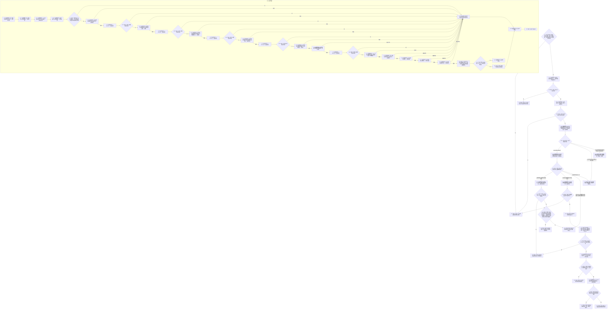

# F-W102 换代实例槽位当前值

根函数：`带值结构写入结果<实例特征槽位值式材料> 节点直接特征写入数据操作::换代实例槽位当前值(const 实例槽位当前值换代请求& 请求)`

归属：节点直接特征写入数据操作模块；待新增。

节点合同：新值已占用的幂等 / 异义分类先于高水位校验；幂等必须同时证明新值主键映射、已失效写前关系、写前值/版本、请求来源和完整新原始值同义。P01 的一次结构读取许可覆盖来源、F-W103 当前槽组合、新值主键、幂等关系审计和高水位；真实写入在 P04 释放许可后才进入独占执行器。现行规则只接受已发布来源，事务外 N00A/N00B 与回调内 C03A/C04 双重准入。只有真实新建值分支要求键值为高水位+1。不重挂旧关系；失效旧关系后的任一失败必须撤销到旧关系仍有效。执行器返回后不读取槽当前状态。
