# F-W103 读取实例槽位当前材料单函数施工流程图

更新时间：2026-07-29

## 函数合同

```text
根函数：
实例槽当前材料读取结果
节点直接特征写入数据操作::读取实例槽位当前材料(
    const 节点直接身份结构读取许可& 许可,
    节点句柄 实例槽) const

归属：海中鱼巣.领域.数据操作.节点直接特征写入 /
海中鱼巣/领域/数据操作.节点直接特征写入.ixx / private const
参数：许可由调用方在同一调用栈内借用且必须有效；实例槽为完整句柄。
返回：成功携带角色1/2/3、来源和当前记录；有效槽确实无角色3时合法未找到并携带非零记录仓版本；其它失败零材料/版本0。
```

## 流程图

```mermaid
flowchart TD
    N00["N00【指令-异常边界】try 执行以下全部读取、归并、筛选和结果构造"] --> N01{"N01【指令-判断】许可有效且实例槽句柄完整"}
    N00 -. 捕获 std::bad_alloc/等价资源异常 .-> N36
    N01 -- 否 --> N02["N02【指令-返回】返回 入口拒绝/无效身份/空材料/版本0"]
    N01 -- 是 --> N06["N06【函数调用】节点仓_.读取节点审计(实例槽) -> 槽节点审计"]
    N06 --> N07{"N07【指令-判断】槽节点有效、类型=特征且主键命名域=实例特征槽身份"}
    N07 -- 否 --> N02
    N07 -- 是 --> X16["X16【函数调用】F-W303(16)"]
    X16 --> N08["N08【函数调用】关系仓_.读取全部关系审计() -> 全关系审计副本"]
    N08 --> X17["X17【函数调用】F-W303(17)"]
    X17 --> N09A["N09A【指令-赋值】审计位置=0、最高版本表=空"]
    N09A --> N09B{"N09B【指令-判断】审计位置是否等于全审计大小"}
    N09B -- 否 --> N09C["N09C【指令-借用】当前审计关系=全审计[审计位置]"]
    N09C --> N09D["N09D【指令-赋值】同编号位置=0、同编号命中=0、最高位置=空"]
    N09D --> N09E{"N09E【指令-判断】同编号位置是否等于最高版本表大小"}
    N09E -- 否 --> N09F["N09F【指令-借用】当前最高关系=最高版本表[同编号位置]"]
    N09F --> N09G{"N09G【指令-判断】关系编号是否相等"}
    N09G -- 否 --> N09H["N09H【指令-推进】同编号位置加一"]
    N09G -- 是 --> N09I["N09I【指令-操作】同编号命中加一并比较版本"]
    N09I --> N09J{"N09J【指令-判断】重复版本或端点/类型漂移"}
    N09J -- 是 --> N10
    N09J -- 否 --> N09K["N09K【指令-赋值】较高版本覆盖最高位置"]
    N09K --> N09H
    N09H --> N09E
    N09E -- 是 --> N09L{"N09L【指令-判断】同编号命中是否为0或1"}
    N09L -- 其它 --> N10
    N09L -- 0 --> N09M["N09M【指令-操作】追加当前审计关系"]
    N09L -- 1 --> N09N["N09N【指令-操作】保留已比较后的最高关系"]
    N09M --> N09O["N09O【指令-推进】审计位置加一"]
    N09N --> N09O
    N09O --> N09B
    N09B -- 是 --> N10{"N10【指令-判断】关系审计结构是否完整"}
    N10 -- 否 --> N11["N11【指令-返回】返回 内部错误/权威读回不一致/空材料/版本0"]
    N10 -- 是 --> X18["X18【函数调用】F-W303(18)"]
    X18 --> N12["N12【指令-赋值】关系位置=0、角色1组=空、角色2组=空"]
    N12 --> N13{"N13【指令-判断】关系位置是否等于最高版本表大小"}
    N13 -- 否 --> N13A["N13A【指令-借用】当前关系=最高版本表[关系位置]"]
    N13A --> N13B{"N13B【指令-判断】是否为目标=实例槽的有效角色1"}
    N13B -- 是 --> N13C["N13C【指令-操作】追加角色1组"]
    N13B -- 否 --> N13D{"N13D【指令-判断】是否为源=实例槽的有效角色2"}
    N13D -- 是 --> N13E["N13E【指令-操作】追加角色2组"]
    N13D -- 否 --> N13F["N13F【指令-推进】关系位置加一"]
    N13C --> N13F
    N13E --> N13F
    N13F --> N13
    N13 -- 是 --> N14{"N14【指令-判断】角色1和角色2是否各恰一"}
    N14 -- 否 --> N15["N15【指令-返回】返回 内部错误/基数不满足/空材料/版本0"]
    N14 -- 是 --> N16["N16【函数调用】节点仓_.读取节点审计(角色1.源节点) -> 宿主节点审计"]
    N16 --> N17{"N17【指令-判断】宿主节点有效且类型属于五种允许宿主"}
    N17 -- 否 --> N11
    N17 -- 是 --> N18["N18【函数调用】节点仓_.读取节点审计(角色2.目标节点) -> 定义节点审计"]
    N18 --> N19{"N19【指令-判断】定义有效、类型=特征且命名域=抽象特征定义身份"}
    N19 -- 否 --> N11
    N19 -- 是 --> N19A["N19A【指令-赋值】候选槽位置=0、同宿主同定义组合数=0"]
    N19A --> N19A1{"N19A1【指令-判断】候选槽位置是否等于最高版本表大小"}
    N19A1 -- 否 --> N19A2["N19A2【指令-借用】候选角色1=最高版本表[候选槽位置]"]
    N19A2 --> N19A3{"N19A3【指令-判断】候选角色1有效、类型22、顺序1且源=宿主"}
    N19A3 -- 否 --> N19A8["N19A8【指令-推进】候选槽位置加一"]
    N19A3 -- 是 --> N19A4["N19A4【指令-赋值】定义扫描位置=0、匹配定义数=0"]
    N19A4 --> N19A5{"N19A5【指令-判断】定义扫描位置是否等于最高版本表大小"}
    N19A5 -- 否 --> N19A6["N19A6【指令-借用】候选角色2=最高版本表[定义扫描位置]"]
    N19A6 --> N19A7{"N19A7【指令-判断】候选角色2有效、类型22、顺序2、源=候选槽且目标=定义"}
    N19A7 -- 是 --> N19A9["N19A9【指令-操作】匹配定义数加一"]
    N19A7 -- 否 --> N19AA["N19AA【指令-推进】定义扫描位置加一"]
    N19A9 --> N19AA
    N19AA --> N19A5
    N19A5 -- 是 --> N19AB{"N19AB【指令-判断】匹配定义数是否恰一"}
    N19AB -- 是 --> N19AC["N19AC【指令-操作】组合数加一并保存候选槽"]
    N19AB -- 否 --> N19A8
    N19AC --> N19A8
    N19A8 --> N19A1
    N19A1 -- 是 --> N19B{"N19B【指令-判断】组合数量是否恰一且就是实例槽"}
    N19A --> N19B{"N19B【指令-判断】组合数量是否恰一且就是实例槽"}
    N19B -- 否 --> N15
    N19B -- 是 --> N20["N20【指令-赋值】关系位置=0、角色3组=空"]
    N20 --> N20A{"N20A【指令-判断】关系位置是否等于最高版本表大小"}
    N20A -- 否 --> N20B["N20B【指令-借用】当前关系=最高版本表[关系位置]"]
    N20B --> N20C{"N20C【指令-判断】当前关系有效、类型22、顺序3且源=实例槽"}
    N20C -- 是 --> N20D["N20D【指令-操作】追加角色3组"]
    N20C -- 否 --> N20E["N20E【指令-推进】关系位置加一"]
    N20D --> N20E
    N20E --> N20A
    N20A -- 是 --> N21{"N21【指令-判断】角色3数量"}
    N21 -- 多条 --> N15
    N21 -- 0 --> N22["N22【函数调用】记录访问器_.读取结构版本() -> 当前记录仓版本结果"]
    N22 --> N23{"N23【指令-判断】版本结果是否成功且非零"}
    N23 -- 否 --> N24["N24【指令-返回】按许可竞争或内部错误返回空材料/版本0"]
    N23 -- 是 --> N25["N25【指令-返回】返回 合法未找到/无/空材料/非零版本"]
    N21 -- 1 --> N26["N26【函数调用】节点仓_.读取节点审计(角色3.目标节点) -> 值节点审计"]
    N26 --> N27{"N27【指令-判断】值节点有效且类型=特征值"}
    N27 -- 否 --> N11
    N27 -- 是 --> X19["X19【函数调用】F-W303(19)"]
    X19 --> N28["N28【指令-赋值】关系位置=0、来源关系组=空"]
    N28 --> N28A{"N28A【指令-判断】关系位置是否等于最高版本表大小"}
    N28A -- 否 --> N28B["N28B【指令-借用】当前关系=最高版本表[关系位置]"]
    N28B --> N28C{"N28C【指令-判断】当前关系有效、类型因果来源、顺序1且源=当前值"}
    N28C -- 是 --> N28D["N28D【指令-操作】追加来源关系组"]
    N28C -- 否 --> N28E["N28E【指令-推进】关系位置加一"]
    N28D --> N28E
    N28E --> N28A
    N28A -- 是 --> N29{"N29【指令-判断】来源关系是否恰一"}
    N29 -- 否 --> N15
    N29 -- 是 --> N30["N30【函数调用】节点仓_.读取节点审计(来源关系.目标节点) -> 来源节点审计"]
    N30 --> N31{"N31【指令-判断】来源节点是否有效"}
    N31 -- 否 --> N11
    N31 -- 是 --> N32A["N32A【函数调用】记录访问器_.读取结构版本() -> 固定记录仓版本结果"]
    N32A --> N32B{"N32B【指令-判断】固定版本结果是否成功且非零"}
    N32B -- 否 --> N24
    N32B -- 是 --> N32["N32【函数调用】记录访问器_.读取当前记录(角色3.目标节点) -> 当前记录结果"]
    N32 --> N33{"N33【指令-判断】记录结果成功、材料值句柄相等且读取结构版本=固定记录仓版本"}
    N33 -- 否 --> N11
    N33 -- 是 --> N33A["N33A【函数调用】记录访问器_.读取结构版本() -> 末次记录仓版本结果"]
    N33A --> N33B{"N33B【指令-判断】末次版本结果成功且等于固定记录仓版本"}
    N33B -- 否 --> N38["N38【指令-返回】返回 读取版本漂移/读取期间版本变化/空材料/版本0"]
    N33B -- 是 --> X20["X20【函数调用】F-W303(20)"]
    X20 --> N34["N34【指令-异常边界】try 构造角色1/2/3/来源证据和完整槽位材料"]
    N34 --> N35{"N35【指令-判断】构造是否抛出资源异常"}
    N35 -- 是 --> N36["N36【指令-返回】丢弃局部材料并返回 内部错误/资源失败/空材料/版本0"]
    N35 -- 否 --> N37["N37【指令-返回】返回 成功/无/完整槽材料/固定记录仓版本"]
```



## 关键边界

```text
角色1/2缺失或多重始终是结构错误；只有角色1/2完整而角色3数量为0时允许合法未找到。
来源关系必须为“当前值 -> 已发布来源”的因果来源/顺序1唯一有效关系，来源节点必须仍有效。
写入根的幂等分支在收到成功材料后还必须把请求宿主、定义、来源、主键映射和三态原始值逐字段比较；本函数本身不替调用方完成请求同义裁决。
存在角色3时，记录读取严格使用 F-A109 -> F-A106 -> F-A109 版本夹取；合法无角色3分支只读取一次 F-A109 并携带该非零版本。
本函数不自行取得或释放结构读取许可；它是 `节点直接特征写入数据操作` 的 private 成员，只允许 F-W101/F-W102 在同一对象、同一调用栈和同一许可内调用，因而外部 importer 不能传入其它事务域的许可绕过同域锁。专项不得直接调用本函数；W15/W16 必须经 F-W101 的幂等/异常分支覆盖。
```
