# F-W104 提交特征批次单函数施工流程图

更新时间：2026-07-29

## 函数合同

```text
根函数：
带值结构写入结果<特征批次提交值式材料>
节点直接特征写入数据操作::提交特征批次(
    const 特征批次变更请求& 请求)

归属：海中鱼巣.领域.数据操作.节点直接特征写入 /
海中鱼巣/领域/数据操作.节点直接特征写入.ixx / public
参数：请求仅调用期借用；批次身份、宿主、规则版本和项目组均为必选。
返回：成功或幂等携带本批次自有值式材料和非零类型化记录仓版本；
      其它分类材料空、版本0。
```

## 流程图

```mermaid
flowchart TD
 N01{"N01【指令-判断】批次身份非零、规则版本=1、宿主完整、项目非空且顺序恰为0..N-1"} -- 否 --> R01["R01【指令-返回】入口拒绝/精确原因/空材料/版本0"]
 N01 -- 是 --> N02["N02【指令-异常边界】try 复制项目，形成按项目序数组、初始槽键数组、新值键数组、换代槽集合和宿主定义键集合"]
 N02 --> N03{"N03【指令-判断】是否捕获 std::bad_alloc 或等价资源失败"}
 N03 -- 是 --> R02["R02【指令-返回】内部错误/资源失败/空材料/版本0"]
 N03 -- 否 --> N04{"N04【指令-判断】每项目 optional 三元组全空或全有，槽/值/换代槽/宿主定义键均不重复"}
 N04 -- 否 --> R03["R03【指令-返回】入口拒绝/同键异义/空材料/版本0"]
 N04 -- 是 --> P01["P01【函数调用】事务域_.取得读取许可() -> 事务外结构读取许可"]
 P01 --> P02{"P02【指令-判断】结构读取许可是否有效"}
 P02 -- 否 --> P05["P05【指令-返回】许可竞争/并发许可失败/空材料/版本0"]
 P02 -- 是 --> N05["N05【函数调用】F-W113 读取特征批次记录(请求.批次身份) -> 事务外批次账"]
 N05 --> N06{"N06【指令-判断】事务外批次账分类"}
 N06 -- 许可竞争/资源失败/内部错误 --> R04["R04【指令-返回】原样保留状态与精确原因；空材料/版本0"]
 N06 -- 找到 --> P03["P03【指令-操作】释放事务外结构读取许可"]
 P03 --> N07["N07【函数调用】F-W110 读取特征批次发布结果(请求.批次身份) -> 历史发布材料"]
 N07 --> N08{"N08【指令-判断】历史发布材料是否成功且非零版本"}
 N08 -- 否 --> R04
 N08 -- 是 --> N09{"N09【指令-判断】批次身份/规则/宿主/项目数/顺序/种类/定义/槽/新值/来源/写前三元组/完整新原始值是否逐字段等于请求"}
 N09 -- 否 --> R03
 N09 -- 是 --> R05["R05【指令-返回】幂等读回/无/历史发布材料/历史非零版本"]
 N06 -- 合法未找到 --> N10["N10【函数调用】节点仓_.读取节点审计(请求.宿主) -> 宿主审计"]
 N10 --> N11{"N11【指令-判断】宿主有效且属于五种允许宿主类型"}
 N11 -- 否 --> R01
 N11 -- 是 --> N12["N12【指令-赋值】事务外项目位置=0"]
 N12 --> N13{"N13【指令-判断】事务外项目位置是否等于项目数"}
 N13 -- 否 --> N14["N14【函数调用】节点仓_.读取节点审计(项目.抽象定义) -> 定义审计"]
 N14 --> N15{"N15【指令-判断】定义有效、类型=特征且稳定主键命名域=抽象特征定义身份"}
 N15 -- 否 --> R01
 N15 -- 是 --> N16["N16【函数调用】节点仓_.读取节点审计(项目.来源) -> 来源审计"]
 N16 --> N17{"N17【指令-判断】来源已发布、有效且完整句柄未漂移"}
 N17 -- 否 --> R01
 N17 -- 是 --> N18{"N18【指令-判断】当前项目是否为换代项目"}
 N18 -- 否 --> N23
 N18 -- 是 --> N19["N19【函数调用】节点仓_.读取节点审计(项目.实例槽) -> 换代槽审计"]
 N19 --> N20{"N20【指令-判断】换代槽有效、类型=特征且主键命名域=实例特征槽身份"}
 N20 -- 否 --> R01
 N20 -- 是 --> N21["N21【函数调用】F-A106 读取当前记录(项目.写前当前值) -> 写前记录"]
 N21 --> N22{"N22【指令-判断】写前记录成功、值句柄及原始值版本逐字段等于请求"}
 N22 -- 否 --> R06["R06【指令-返回】写前漂移/精确原因/空材料/版本0"]
 N22 -- 是 --> N23["N23【指令-赋值】事务外项目位置加一"]
 N23 --> N13
 N13 -- 是 --> N24["N24【函数调用-异常边界】try 关系仓_.读取全部关系审计() -> 事务外关系审计"]
 N24 --> N25{"N25【指令-判断】是否捕获 std::bad_alloc 或等价资源失败"}
 N25 -- 是 --> R02
 N25 -- 否 --> N26["N26【指令-异常边界】try 构造关系编号到最高版本记录表"]
 N26 --> N26A["N26A【指令-赋值】换代项目位置=0"]
 N26A --> N26B{"N26B【指令-判断】换代项目位置是否等于换代项目数"}
 N26B -- 否 --> N26C["N26C【指令-赋值】关系位置=0、写前精确命中数=0、写前精确记录=空"]
 N26C --> N26C1{"N26C1【指令-判断】关系位置是否等于最高版本表.size()"}
 N26C1 -- 否 --> N26C2["N26C2【指令-借用】当前关系=最高版本表[关系位置]"]
 N26C2 --> N26C3{"N26C3【指令-判断】当前关系完整句柄是否等于当前换代项目.写前当前关系"}
 N26C3 -- 是 --> N26C4["N26C4【指令-操作】写前精确命中数加一并复制当前关系"]
 N26C3 -- 否 --> N26C5["N26C5【指令-推进】关系位置加一"]
 N26C4 --> N26C5
 N26C5 --> N26C1
 N26C1 -- 是 --> N26D{"N26D【指令-判断】命中数恰一且记录端点、类型、顺序、状态和版本逐字段等于写前三元组"}
 N26D -- 否 --> N28
 N26D -- 是 --> N26E["N26E【指令-赋值】换代项目位置加一"]
 N26E --> N26B
 N26B -- 是 --> N26F["N26F【指令-赋值】初始项目位置=0"]
 N26F --> N26G{"N26G【指令-判断】初始项目位置是否等于初始项目数"}
 N26G -- 否 --> N26H["N26H【指令-赋值】角色1位置=0、同宿主同定义组合基数=0"]
 N26H --> N26H1{"N26H1【指令-判断】角色1位置是否等于最高版本表.size()"}
 N26H1 -- 否 --> N26H2["N26H2【指令-借用】角色1候选=最高版本表[角色1位置]"]
 N26H2 --> N26H3{"N26H3【指令-判断】角色1候选有效、类型22、顺序1、源=请求宿主"}
 N26H3 -- 否 --> N26H7["N26H7【指令-推进】角色1位置加一"]
 N26H3 -- 是 --> N26H4["N26H4【指令-赋值】角色2位置=0、当前槽匹配定义数量=0"]
 N26H4 --> N26H5{"N26H5【指令-判断】角色2位置是否等于最高版本表.size()"}
 N26H5 -- 否 --> N26H6["N26H6【指令-检查】当前关系是否为角色1候选目标槽到当前项目定义的有效顺序2关系；是则数量加一"]
 N26H6 --> N26H8["N26H8【指令-推进】角色2位置加一"]
 N26H8 --> N26H5
 N26H5 -- 是 --> N26H9{"N26H9【指令-判断】当前槽匹配定义数量是否恰一"}
 N26H9 -- 是 --> N26H10["N26H10【指令-操作】同宿主同定义组合基数加一"]
 N26H9 -- 否 --> N26H7
 N26H10 --> N26H7
 N26H7 --> N26H1
 N26H1 -- 是 --> N26I{"N26I【指令-判断】组合基数是否为0"}
 N26I -- 否 --> N28
 N26I -- 是 --> N26J["N26J【指令-赋值】初始项目位置加一"]
 N26J --> N26G
 N26G -- 是 --> N27{"N27【指令-判断】是否捕获 std::bad_alloc 或等价资源失败"}
 N27 -- 是 --> R02
 N27 -- 否 --> N28{"N28【指令-判断】事务外关系复核分类"}
 N28 -- 写前漂移 --> R06
 N28 -- 同宿主同定义已存在 --> R03
 N28 -- 重复版本/悬空/基数异常 --> R07["R07【指令-返回】内部错误/权威读回不一致/空材料/版本0"]
 N28 -- 完整且未占用 --> N29["N29【函数调用】节点仓_.读取命名域高水位(实例特征槽身份) -> 槽高水位"]
 N29 --> N30["N30【函数调用】节点仓_.读取命名域高水位(特征值身份) -> 值高水位"]
 N30 --> N31{"N31【指令-判断】排序后的初始槽键/全部新值键是否分别为对应高水位后的连续区间"}
 N31 -- 否 --> R08["R08【指令-返回】入口拒绝/错版本/空材料/版本0"]
 N31 -- 是 --> P04["P04【指令-操作】释放事务外结构读取许可"]
 P04 --> N32["N32【指令-异常边界】try 构造记录参与者、批次参与者、参与者 span、回调结果槽和全部项目句柄数组"]
 N32 --> N33{"N33【指令-判断】是否捕获 std::bad_alloc 或等价资源失败"}
 N33 -- 是 --> R02
 N33 -- 否 --> H01{"H01【指令-判断】专项宏开启且写入阶段点1回调已设置"}
 H01 -- 否 --> N34["N34【函数调用】执行器_.执行(回调, span{记录参与者,批次参与者}) -> 核心结果"]
 H01 -- 是 --> H02["H02【指令-赋值】把阶段回调和上下文复制到局部变量"]
 H02 --> H03["H03【指令-操作】清除线程局部阶段回调状态"]
 H03 --> H04["H04【函数调用】局部阶段回调(局部上下文)"]
 H04 --> N34

 subgraph CB["N34 回调：同一核心独占许可内"]
  C01["C01【函数调用】F-W113 读取特征批次记录(请求.批次身份) -> 锁内批次账"] --> C02{"C02【指令-判断】锁内批次账分类"}
  C02 -- 许可竞争/资源失败/内部错误 --> E01["E01【指令-赋值】保存锁内批次账精确失败"]
  C02 -- 找到 --> C03["C03【函数调用】F-A109 读取类型化记录仓结构版本() -> 锁内固定记录仓版本"]
  C03 --> C04{"C04【指令-判断】固定版本成功且非零"}
  C04 -- 否 --> E02["E02【指令-赋值】保存记录仓许可或内部失败"]
  C04 -- 是 --> C05["C05【函数调用-异常边界】try 关系仓_.读取全部关系审计() -> 锁内历史关系审计"]
  C05 --> C06{"C06【指令-判断】是否捕获 std::bad_alloc 或等价资源失败"}
  C06 -- 是 --> E03["E03【指令-赋值】保存内部错误/资源失败"]
  C06 -- 否 --> C07["C07【指令-赋值】历史比较项目位置=0"]
  C07 --> C08{"C08【指令-判断】历史比较项目位置是否等于项目数"}
  C08 -- 否 --> C09["C09【函数调用】会话.读取节点(账项目.抽象定义) -> 锁内定义"]
  C09 --> C10["C10【函数调用】会话.读取节点(账项目.实例槽) -> 锁内槽"]
  C10 --> C11["C11【函数调用】会话.读取节点(账项目.新特征值) -> 锁内新值"]
  C11 --> C12["C12【函数调用】会话.读取节点(账项目.来源) -> 锁内来源"]
  C12 --> C13["C13【函数调用】会话.读取关系审计(账项目.宿主关系) -> 宿主关系审计"]
  C13 --> C14["C14【函数调用】会话.读取关系审计(账项目.定义关系) -> 定义关系审计"]
  C14 --> C15["C15【函数调用】会话.读取关系审计(账项目.发布后当前关系) -> 当前关系审计"]
  C15 --> C16["C16【函数调用】会话.读取关系审计(账项目.来源关系) -> 来源关系审计"]
  C16 --> C17{"C17【指令-判断】账项目是否为换代项目"}
  C17 -- 是 --> C18["C18【函数调用】会话.读取关系审计(账项目.写前当前关系) -> 写前关系审计"]
  C17 -- 否 --> C19
  C18 --> C19["C19【函数调用】F-A107 读取审计记录(账项目.新特征值) -> 新值记录组"]
  C19 --> C20{"C20【指令-判断】节点/四关系/可选写前关系/唯一新值记录与账完整互证，且账项目与请求同位置项目连同完整新原始值逐字段同义"}
  C20 -- 否 --> E04["E04【指令-赋值】保存入口拒绝/同键异义或内部错误/权威读回不一致"]
  C20 -- 是 --> C21["C21【指令-赋值】历史比较项目位置加一"]
  C21 --> C08
  C08 -- 是 --> C22["C22【函数调用】F-A109 读取类型化记录仓结构版本() -> 锁内末次记录仓版本"]
  C22 --> C23{"C23【指令-判断】末次版本成功且等于固定版本"}
  C23 -- 否 --> E05["E05【指令-赋值】保存读取版本漂移/读取期间版本变化"]
  C23 -- 是 --> E06["E06【指令-赋值】保存幂等分类"]

  C02 -- 合法未找到 --> C30["C30【函数调用】会话.读取节点(请求.宿主) -> 锁内宿主"]
  C30 --> C31{"C31【指令-判断】锁内宿主是否与事务外审计逐字段相等且有效"}
  C31 -- 否 --> E07["E07【指令-赋值】保存写前漂移/读取期间版本变化"]
  C31 -- 是 --> C32["C32【函数调用-异常边界】try 关系仓_.读取全部关系审计() -> 锁内当前关系审计"]
  C32 --> C33{"C33【指令-判断】是否捕获 std::bad_alloc 或等价资源失败"}
  C33 -- 是 --> E03
  C33 -- 否 --> C34["C34【指令-赋值】锁内准入项目位置=0"]
  C34 --> C35{"C35【指令-判断】锁内准入项目位置是否等于项目数"}
  C35 -- 否 --> C36["C36【函数调用】会话.读取节点(项目.抽象定义) -> 锁内定义"]
  C36 --> C37["C37【函数调用】会话.读取节点(项目.来源) -> 锁内来源"]
  C37 --> C38{"C38【指令-判断】定义/来源是否与事务外审计逐字段相等且有效"}
  C38 -- 否 --> E07
  C38 -- 是 --> C39{"C39【指令-判断】当前项目是否为换代项目"}
  C39 -- 否 --> C44
  C39 -- 是 --> C40["C40【函数调用】会话.读取节点(项目.实例槽) -> 锁内换代槽"]
  C40 --> C41["C41【函数调用】会话.读取关系审计(项目.写前当前关系) -> 锁内写前关系"]
  C41 --> C42["C42【函数调用】F-A106 读取当前记录(项目.写前当前值) -> 锁内写前记录"]
  C42 --> C43{"C43【指令-判断】槽、写前关系、写前值和版本是否仍与请求逐字段相等"}
  C43 -- 否 --> E07
  C43 -- 是 --> C44["C44【指令-赋值】锁内准入项目位置加一"]
  C44 --> C35
  C35 -- 是 --> C45["C45【指令-异常边界】try 构造锁内关系编号到最高版本记录表"]
  C45 --> C45A["C45A【指令-赋值】锁内初始项目位置=0"]
  C45A --> C45B{"C45B【指令-判断】位置是否等于初始项目数"}
  C45B -- 否 --> C45C["C45C【指令-赋值】锁内角色1位置=0、锁内组合基数=0"]
  C45C --> C45C1{"C45C1【指令-判断】锁内角色1位置是否等于锁内最高版本表.size()"}
  C45C1 -- 否 --> C45C2["C45C2【指令-借用】锁内角色1候选=锁内最高版本表[锁内角色1位置]"]
  C45C2 --> C45C3{"C45C3【指令-判断】候选有效、类型22、顺序1、源=请求宿主"}
  C45C3 -- 否 --> C45C7["C45C7【指令-推进】锁内角色1位置加一"]
  C45C3 -- 是 --> C45C4["C45C4【指令-赋值】锁内角色2位置=0、当前槽匹配定义数量=0"]
  C45C4 --> C45C5{"C45C5【指令-判断】锁内角色2位置是否等于锁内最高版本表.size()"}
  C45C5 -- 否 --> C45C6["C45C6【指令-检查】当前关系是否为候选槽到当前项目定义的有效顺序2关系；是则数量加一"]
  C45C6 --> C45C8["C45C8【指令-推进】锁内角色2位置加一"]
  C45C8 --> C45C5
  C45C5 -- 是 --> C45C9{"C45C9【指令-判断】当前槽匹配定义数量是否恰一"}
  C45C9 -- 是 --> C45C10["C45C10【指令-操作】锁内组合基数加一"]
  C45C9 -- 否 --> C45C7
  C45C10 --> C45C7
  C45C7 --> C45C1
  C45C1 -- 是 --> C45D{"C45D【指令-判断】组合基数是否为0"}
  C45D -- 否 --> E08
  C45D -- 是 --> C45E["C45E【指令-赋值】锁内初始项目位置加一"]
  C45E --> C45B
  C45B -- 是 --> C46{"C46【指令-判断】是否捕获 std::bad_alloc 或等价资源失败"}
  C46 -- 是 --> E03
  C46 -- 否 --> C47{"C47【指令-判断】锁内唯一性是否仍完整且未占用"}
  C47 -- 否 --> E08["E08【指令-赋值】保存同键异义、写前漂移或权威读回不一致的精确分类"]
  C47 -- 是 --> C50["C50【指令-赋值】初始槽键位置=0"]
  C50 --> C51{"C51【指令-判断】初始槽键位置是否等于初始槽键数"}
  C51 -- 否 --> C52["C52【函数调用】会话.创建节点候选(特征, 初始槽键[位置].稳定主键) -> 槽候选"]
  C52 --> C53{"C53【指令-判断】槽候选是否成功"}
  C53 -- 否 --> E09["E09【指令-赋值】保存首个核心失败；并发高水位推进映射写前漂移，其它不可能拒绝映射内部错误"]
  C53 -- 是 --> C54["C54【指令-赋值】按初始槽键[位置].项目顺序号保存槽候选句柄"]
  C54 --> C55["C55【指令-赋值】初始槽键位置加一"]
  C55 --> C51
  C51 -- 是 --> C56["C56【指令-赋值】新值键位置=0"]
  C56 --> C57{"C57【指令-判断】新值键位置是否等于新值键数"}
  C57 -- 否 --> C58["C58【函数调用】会话.创建节点候选(特征值, 新值键[位置].稳定主键) -> 值候选"]
  C58 --> C59{"C59【指令-判断】值候选是否成功"}
  C59 -- 否 --> E09
  C59 -- 是 --> C60["C60【指令-赋值】按新值键[位置].项目顺序号保存值候选句柄"]
  C60 --> C61["C61【指令-赋值】新值键位置加一"]
  C61 --> C57
  C57 -- 是 --> C62["C62【指令-赋值】写入项目位置=0"]
  C62 --> C63{"C63【指令-判断】写入项目位置是否等于项目数"}
  C63 -- 否 --> C64{"C64【指令-判断】当前项目是否为初始项目"}
  C64 -- 是 --> C65["C65【函数调用】会话.创建关系候选(特征实例角色, 请求.宿主, 槽句柄[项目], 1) -> 宿主关系"]
  C65 --> C66{"C66【指令-判断】宿主关系是否成功"}
  C66 -- 否 --> E09
  C66 -- 是 --> C67["C67【函数调用】会话.创建关系候选(特征实例角色, 槽句柄[项目], 项目.抽象定义, 2) -> 定义关系"]
  C67 --> C68{"C68【指令-判断】定义关系是否成功"}
  C68 -- 否 --> E09
  C68 -- 是 --> C73
  C64 -- 否 --> C69["C69【函数调用】会话.失效关系候选(项目.写前当前关系) -> 写前关系失效结果"]
  C69 --> C70{"C70【指令-判断】失效结果是否成功"}
  C70 -- 否 --> E09
  C70 -- 是 --> C71["C71【指令-赋值】宿主关系=锁内审计中实例槽唯一有效角色1句柄"]
  C71 --> C72["C72【指令-赋值】定义关系=锁内审计中实例槽唯一有效角色2句柄"]
  C72 --> X12["X12【函数调用】F-W312(12) -> 固定结果"]
  X12 --> X12A{"X12A【指令-判断】固定结果是否有值"}
  X12A -- 是 --> E09
  X12A -- 否 --> C73["C73【函数调用】会话.创建关系候选(特征实例角色, 槽句柄[项目], 值句柄[项目], 3) -> 发布后当前关系"]
  C73 --> C74{"C74【指令-判断】发布后当前关系是否成功"}
  C74 -- 否 --> E09
  C74 -- 是 --> X13["X13【函数调用】F-W312(13) -> 固定结果"]
  X13 --> X13A{"X13A【指令-判断】固定结果是否有值"}
  X13A -- 是 --> E09
  X13A -- 否 --> C75["C75【函数调用】会话.创建关系候选(因果来源, 值句柄[项目], 项目.来源, 1) -> 来源关系"]
  C75 --> C76{"C76【指令-判断】来源关系是否成功"}
  C76 -- 否 --> E09
  C76 -- 是 --> C77{"C77【指令-判断】当前项目是否为初始项目"}
  C77 -- 是 --> X14["X14【函数调用】F-W312(14) -> 固定结果"]
  X14 --> X14A{"X14A【指令-判断】固定结果是否有值"}
  X14A -- 是 --> E09
  X14A -- 否 --> C78["C78【函数调用】会话.创建索引候选(槽物理键, 节点目标槽句柄) -> 槽索引"]
  C78 --> C79{"C79【指令-判断】槽索引是否成功"}
  C79 -- 否 --> E09
  C79 -- 是 --> C80["C80【函数调用】会话.读取索引物理键(槽物理键) -> 槽索引读回"]
  C80 --> C81{"C81【指令-判断】槽索引读回是否逐字段等于候选"}
  C81 -- 否 --> E10["E10【指令-赋值】保存内部错误/权威读回不一致"]
  C81 -- 是 --> C82
  C77 -- 否 --> X15["X15【函数调用】F-W312(15) -> 固定结果"]
  X15 --> X15A{"X15A【指令-判断】固定结果是否有值"}
  X15A -- 是 --> E09
  X15A -- 否 --> C82["C82【函数调用】会话.创建索引候选(值物理键, 节点目标值句柄) -> 值索引"]
  C82 --> C83{"C83【指令-判断】值索引是否成功"}
  C83 -- 否 --> E09
  C83 -- 是 --> C84["C84【函数调用】会话.读取索引物理键(值物理键) -> 值索引读回"]
  C84 --> C85{"C85【指令-判断】值索引读回是否逐字段等于候选"}
  C85 -- 否 --> E10
  C85 -- 是 --> X16["X16【函数调用】F-W312(16) -> 固定结果"]
  X16 --> X16A{"X16A【指令-判断】固定结果是否有值"}
  X16A -- 是 --> E09
  X16A -- 否 --> C86["C86【函数调用】F-A101 登记记录候选({值句柄[项目],1,项目.新原始值}) -> 记录候选结果"]
  C86 --> C87{"C87【指令-判断】记录候选结果是否成功或同一参与者私有幂等"}
  C87 -- 否 --> E11["E11【指令-赋值】保存记录候选的精确领域失败"]
  C87 -- 是 --> C88["C88【函数调用】会话.读取节点(值句柄[项目]) -> 新值读回"]
  C88 --> C89["C89【函数调用】会话.读取关系(发布后当前关系) -> 当前关系读回"]
  C89 --> C90["C90【函数调用】会话.读取关系(来源关系) -> 来源关系读回"]
  C90 --> C91{"C91【指令-判断】新值、当前关系和来源关系读回是否逐字段等于候选"}
  C91 -- 否 --> E10
  C91 -- 是 --> C92["C92【指令-异常边界】try 用本项目确切句柄和记录版本1构造批次引用及候选返回项目"]
  C92 --> C93{"C93【指令-判断】是否捕获 std::bad_alloc 或等价资源失败"}
  C93 -- 是 --> E03
  C93 -- 否 --> C94["C94【指令-赋值】写入项目位置加一"]
  C94 --> C63
  C63 -- 是 --> C95["C95【指令-异常边界】try 用规范化请求与全部有序批次引用构造完整批次记录"]
  C95 --> C96{"C96【指令-判断】是否捕获 std::bad_alloc 或等价资源失败"}
  C96 -- 是 --> E03
  C96 -- 否 --> X17["X17【函数调用】F-W312(17) -> 固定结果"]
  X17 --> X17A{"X17A【指令-判断】固定结果是否有值"}
  X17A -- 是 --> E09
  X17A -- 否 --> C97["C97【函数调用】F-W105 登记特征批次记录候选(完整批次记录) -> 批次候选结果"]
  C97 --> C98{"C98【指令-判断】批次候选结果是否成功"}
  C98 -- 否 --> E12["E12【指令-赋值】保存批次候选的精确领域失败"]
  C98 -- 是 --> C99["C99【指令-异常边界】try 用全部有序候选返回项目形成完整候选返回材料"]
  C99 --> C100{"C100【指令-判断】是否捕获 std::bad_alloc 或等价资源失败"}
  C100 -- 是 --> E03
  C100 -- 否 --> C101["C101【函数调用】会话.请求提交()"]

  E01 --> X01["X01【函数调用】会话.请求撤销()"]
  E02 --> X01
  E03 --> X01
  E04 --> X01
  E05 --> X01
  E06 --> X01
  E07 --> X01
  E08 --> X01
  E09 --> X01
  E10 --> X01
  E11 --> X01
  E12 --> X01
  X01 --> X02["X02【指令-返回】结束回调"]
 end

 N34 --> N35{"N35【指令-判断】核心结果与回调保存分类"}
 N35 -- 候选已撤销且保存幂等 --> N36["N36【函数调用】F-W110 读取特征批次发布结果(请求.批次身份) -> 幂等历史材料"]
 N36 --> N37{"N37【指令-判断】历史材料成功、非零版本且逐字段等于请求"}
 N37 -- 否 --> R07
 N37 -- 是 --> R05
 N35 -- 候选已撤销且保存失败 --> R09["R09【指令-返回】返回保存的精确状态/原因；空材料/版本0"]
 N35 -- 其它非已提交 --> R10["R10【指令-返回】按核心结果精确映射；空材料/版本0"]
 N35 -- 已提交 --> N38["N38【函数调用】F-A110 读取本事务发布结构版本() -> 本事务记录仓版本"]
 N38 --> N39{"N39【指令-判断】候选返回材料存在且本事务版本成功非零"}
 N39 -- 否 --> R07
 N39 -- 是 --> R11["R11【指令-返回】成功/无/回调捕获的确切候选材料/本事务版本"]
```



## 节点合同

```text
1. 事务外批次账找到时必须先调用 F-W110 重建历史材料，再把请求的宿主、定义、
   槽/值主键映射、来源、写前三元组和完整新原始值逐项目比较；批次账本体不复制
   原始值，不能单凭 F-W113 裁决完整同义。
2. 回调内发现同键账时禁止调用 F-W110，因为 F-W110 会再次取得结构读取许可；
   C03—C23 使用当前会话、全关系审计、F-A107 和 F-A109 版本夹取完成同一完整比较。
3. 真实写入先按槽命名域键序创建全部初始槽，再按值命名域键序创建全部新值，
   句柄按项目顺序号回填。每个核心调用、结果判断和位置推进都是独立节点。
4. 初始项目创建角色1/2；换代项目复用唯一角色1/2并失效写前角色3；两类项目都
   创建发布后角色3、来源关系、值索引和类型化记录。槽索引只属于初始项目。
5. 任一回调失败只保存首个精确领域结果并请求撤销；真实提交返回回调捕获的确切
   候选材料和 F-A110 版本，不在释放独占许可后调用当前槽或历史批次读回。
6. N02/N26/N32、C05/C32/C45、C92/C95/C99 是明确资源异常边界；捕获后丢弃局部
   材料、保存资源失败并撤销，不返回半结构。
7. P01 的一次结构读取许可覆盖 F-W113 未找到判定、宿主/定义/来源/写前三元组、
   两命名域高水位和事务外关系审计；找到分支在 P03 释放后由 F-W110 自己取得
   完整快照，真实分支在 P04 释放后才进入独占执行器。H01—H04 只在专项宏开启
   时形成确定先行事务窗口，生产宏关闭时直接到 N34。
```

## 关键边界

批次一次事务同时包含全部节点、关系22、来源关系、索引、类型化记录参与者和批次记录参与者；不得拆成逐项目子事务。项目顺序固定为 `0..N-1`，幂等分类先于高水位检查，真实新建才要求两个命名域分别连续。完整失败映射、参与者准备/确认/逆序撤销/最后发布由详细设计第 8 节和 W01—W39 逐用例矩阵共同冻结。
