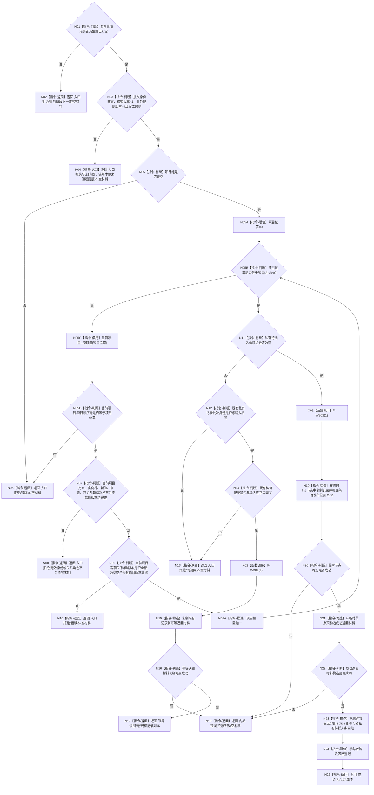

# F-W105 登记特征批次记录候选单函数施工流程图

更新时间：2026-07-29

## 依据

```text
规范/4170_子规范_特征批次发布记录与幂等账.md
规范/详细设计/NODE-TYPED-MIGRATION_NT-P2A_特征值类型化记录与当前关系迁移详细设计.md
```

## 身份与边界

本图是待新增函数的正式单函数施工流程图。它只验证并预分配一条批次记录候选，不取得批次仓锁，不写核心节点、关系或索引。

## 函数合同

```text
根函数：
特征批次记录候选结果
节点直接特征批次记录参与者::登记候选(
    const 节点直接特征批次记录& 记录)

归属模块 / 文件 / 层级：
海中鱼巣.领域.参与者.节点直接特征批次记录
海中鱼巣/领域/参与者.节点直接特征批次记录.ixx
public 成员函数

参数：
记录，调用期只读借用；批次身份、格式、规则、宿主、完整有序项目和关系引用必须完整。

返回：
新键：成功/无/记录副本；
本参与者私有同键同义：幂等读回/无/既有记录副本；
同键异义或错阶段：入口拒绝/同键异义或事务阶段不一致/空材料；
分配失败：内部错误/资源失败/空材料。
```

## 流程图



## 节点合同

| 节点 | 类型 | 输入绑定 | 输出 | 事实读写 | 后继 | 验证 |
| --- | --- | --- | --- | --- | --- | --- |
| N01 | 指令-判断 | `阶段_` | 可登记布尔 | 只读参与者阶段 | 是/否 | W25 |
| N03/N05/N07/N09 | 指令-判断 | `记录` 全字段 | 完整性布尔 | 无机器事实写入 | 是/否 | W25/W26 |
| N12/N14 | 指令-判断 | 私有唯一记录、输入记录 | 同键/同义布尔 | 只读私有候选 | 是/否 | W27/W28 |
| N15/N21 | 指令-构造 | 既有记录或临时节点 | 完整返回材料 | 仅调用栈临时内存 | 成功/失败 | W28/W29 |
| N19 | 指令-构造 | 输入记录 | 临时未发布仓条目 | 仅私有临时内存 | 成功/失败 | W25/W29 |
| N23 | 指令-操作 | 临时 list 节点 | 私有候选节点 | 仅参与者私有候选 | 完成 | W29 |
| N02/N04/N06/N08/N10/N13/N17/N18/N25 | 指令-返回 | 具名分类 | 完整候选结果 | 无仓写入 | 终止 | W25—W29 |

## 关键边界

```text
节点直接特征批次记录本体没有发布布尔字段；发布状态只属于私有仓条目。
同键同义必须比较格式、规则、宿主、项目顺序和每项全部引用字段；不得用摘要、地址或对象内存比较。
幂等与成功返回材料都必须在任何参与者状态修改前复制完成；N23 后不得再执行可能分配的操作。
临时 list 节点或返回材料构造失败均保持调用前私有候选不变。
```
