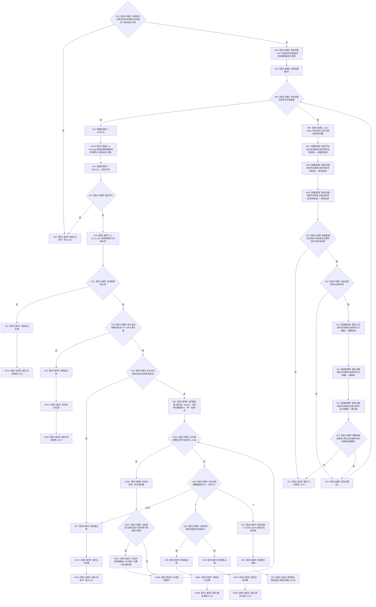

# F-W106 准备特征批次记录提交单函数施工流程图

更新时间：2026-07-29

## 依据

```text
规范/4170_子规范_特征批次发布记录与幂等账.md
海中鱼巣/核心/会话.节点直接身份结构写入.ixx
规范/详细设计/NODE-TYPED-MIGRATION_NT-P2A_特征值类型化记录与当前关系迁移详细设计.md
```

## 身份与边界

本图是待新增事务参与者准备函数的正式单函数施工流程图。它逐节点消费核心准备只读视图，随后在批次仓独占锁内完成最终同键竞争检查和无分配 splice。

## 函数合同

```text
根函数：
节点直接身份结构写入结果
节点直接特征批次记录参与者::准备提交(
    const 节点直接身份结构提交准备只读视图& 视图)

归属模块 / 文件 / 层级：
海中鱼巣.领域.参与者.节点直接特征批次记录
海中鱼巣/领域/参与者.节点直接特征批次记录.ixx
private override

参数：
视图，执行器调用期只读借用；不得保存。

返回：
准备成功：{候选已确认,0,0,0}；
已发布同键同义：{版本漂移,0,0,0}；
已发布同键异义：{身份冲突,0,0,0}；
锁竞争：{许可拒绝,0,0,0}；
候选节点、阶段或结构异常：入口拒绝或内部不一致；
版本溢出：{资源失败,0,0,0}。
```

## 流程图



## 节点合同

| 节点 | 类型 | 输入绑定 | 输出 | 事实读写 | 后继 | 验证 |
| --- | --- | --- | --- | --- | --- | --- |
| N07/N13 | 函数调用 | 候选完整句柄 -> `节点` | 候选布尔 | 只读核心候选 | 完成 | W30/W31 |
| N08/N14 | 函数调用 | 同一候选句柄 -> `节点` | `optional<节点类型>` | 只读核心候选 | 完成 | W30/W31 |
| N09/N15 | 函数调用 | 同一候选句柄 -> `节点` | `optional<节点稳定主键>` | 只读核心候选 | 完成 | W30/W31 |
| N20 | 指令-操作 | 批次仓互斥 | 独占锁 | 取得私有仓许可 | 成功/失败 | W32 |
| N25/N28 | 指令-读取/判断 | 仓条目、输入记录 | 数量和同义布尔 | 只读已发布仓条目 | 分支 | W33/W34 |
| N31 | 指令-操作 | 私有 list 节点、仓 list | 稳定迭器仍有效 | 私有候选移入仓，未发布 | 完成 | W35 |
| 返回节点 | 指令-返回 | 具名核心分类 | 四字段核心结果 | 失败不留下仓候选 | 终止 | W30—W35 |

## 关键边界

```text
三个准备视图入口必须逐个调用，不得由句柄外观或调用方请求代替核心候选身份。
换代项目的实例槽是已发布节点，不得要求它是本会话候选；初始项目必须要求实例槽和新值都为本会话候选。
N06 只建立 `const&` 借用，不复制项目。进入仓锁前已完成全部可能分配；全部视图校验通过后才以 noexcept 赋值写成员反向位置，后续每条失败边都清空该成员；持锁分支只有线性扫描、逐字段比较和 list::splice。
同义竞争不返回幂等成功，因为事务外或回调第一写前应已收口；此处精确返回核心版本漂移以触发整体撤销。
```
