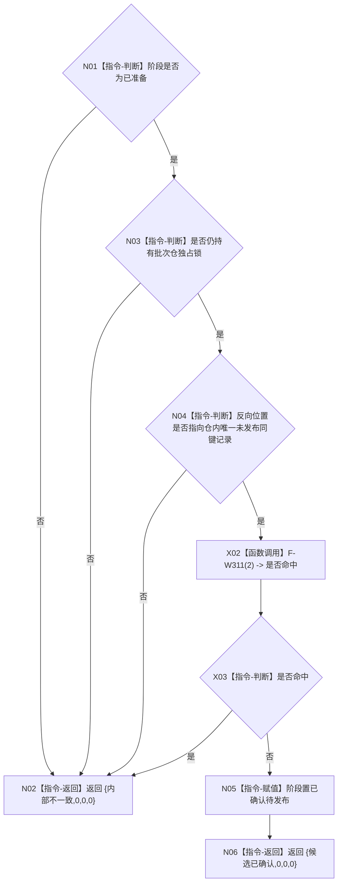

# F-W107 确认特征批次记录待发布单函数施工流程图

更新时间：2026-07-29

## 函数合同

```text
根函数：
节点直接身份结构写入结果
节点直接特征批次记录参与者::确认待发布()

归属：海中鱼巣.领域.参与者.节点直接特征批次记录 /
海中鱼巣/领域/参与者.节点直接特征批次记录.ixx / private override
参数：无。
返回：成功 {候选已确认,0,0,0}；结构或阶段异常 {内部不一致,0,0,0}。
```

## 流程图



## 节点合同

| 节点 | 类型 | 输入 | 输出 / 后继 | 事实读写 | 验证 |
| --- | --- | --- | --- | --- | --- |
| N01/N03/N04 | 指令-判断 | 阶段、锁、稳定迭代器 | 是/否 | 只读参与者和未发布仓条目 | W36 |
| N05 | 指令-赋值 | 已准备阶段 | 已确认待发布 | 只改参与者阶段 | W36 |
| N02/N06 | 指令-返回 | 具名结果 | 终止 | 不发布、不解锁 | W36 |

## 关键边界

```text
本函数不分配、不发布、不推进结构版本、不释放锁。
仓条目发布位在本函数成功后仍为 false。
```
