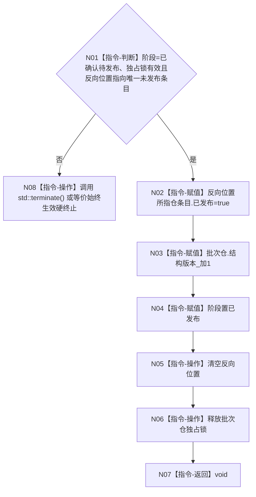

# F-W108 完成发布特征批次记录单函数施工流程图

更新时间：2026-07-29

## 函数合同

```text
根函数：void 节点直接特征批次记录参与者::完成发布() noexcept
归属：海中鱼巣.领域.参与者.节点直接特征批次记录 /
海中鱼巣/领域/参与者.节点直接特征批次记录.ixx / private override
参数：无。
返回：void；仅由执行器在核心和全部参与者确认成功后调用。
```

## 流程图



## 节点合同

| 节点 | 类型 | 输入 | 输出 | 事实读写 | 验证 |
| --- | --- | --- | --- | --- | --- |
| N01 | 指令-判断 | 阶段、锁、迭代器 | 是/否 | 只读已确认候选 | W37 |
| N02 | 指令-赋值 | 唯一仓条目 | 发布位 true | 发布批次仓条目 | W37 |
| N03 | 指令-赋值 | 非最大结构版本 | 版本+1 | 推进批次仓版本一次 | W37 |
| N04/N05/N06 | 指令-赋值/操作 | 参与者私有状态 | 已发布且无锁 | 收口生命周期 | W37 |
| N07 | 指令-返回 | 无 | void | 无 | W37 |
| N08 | 指令-操作 | 不变量破坏 | 不返回 | 始终生效硬终止 | W37 |

## 关键边界

```text
节点直接特征批次记录本体没有发布位；N02 只修改私有仓条目发布位。
版本溢出已经由 F-W106 在确认前拒绝。
全函数 noexcept，禁止分配、日志和可恢复失败返回；N08 必须在 Release/NDEBUG 下仍生效，禁止仅使用会被编译掉的 `assert`。
```
