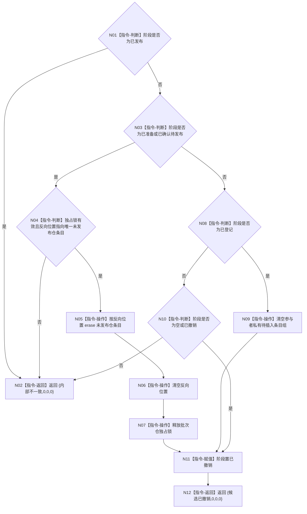

# F-W109 完成撤销特征批次记录单函数施工流程图

更新时间：2026-07-29

## 函数合同

```text
根函数：节点直接身份结构写入结果 节点直接特征批次记录参与者::完成撤销()
归属：海中鱼巣.领域.参与者.节点直接特征批次记录 /
海中鱼巣/领域/参与者.节点直接特征批次记录.ixx / private override
参数：无。
返回：空、已登记、已准备、已确认待发布或已撤销均为 {候选已撤销,0,0,0}；
已发布或反向位置损坏为 {内部不一致,0,0,0}。
```

## 流程图



## 节点合同

| 节点 | 类型 | 输入 | 输出 / 后继 | 事实读写 | 验证 |
| --- | --- | --- | --- | --- | --- |
| N01/N03/N08/N10 | 指令-判断 | 阶段 | 具名分支 | 只读参与者阶段 | W38 |
| N04 | 指令-判断 | 锁、反向位置、仓条目发布位 | 完整性布尔 | 只读未发布仓条目 | W38 |
| N05 | 指令-操作 | 稳定迭代器 | 条目删除 | 删除本事务未发布仓候选 | W38 |
| N09 | 指令-操作 | 私有 list | 空私有组 | 清理未入仓候选 | W38 |
| N11 | 指令-赋值 | 合法可撤销阶段 | 已撤销 | 收口参与者阶段 | W38/W39 |
| N02/N12 | 指令-返回 | 具名核心结果 | 终止 | 不推进结构版本 | W38/W39 |

## 关键边界

```text
空参与者撤销必须成功，保证批次回调第一写前失败时执行器可逆序撤销完整 span。
撤销只删除仓条目发布位仍为 false 的节点；已发布事实不可撤销。
批次参与者在登记顺序 [记录参与者, 批次参与者] 的逆序撤销中先收口。
```
