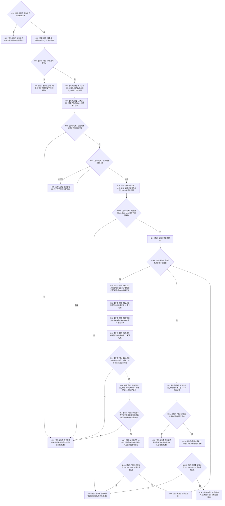

# F-W110 读取特征批次发布结果

根函数：`特征批次发布读取结果 节点直接特征写入数据操作::读取特征批次发布结果(节点直接特征批次身份 批次身份) const`

归属：节点直接特征写入数据操作模块；待新增。

节点合同：不调用 F-W103，不读取槽当前值；槽后续换代后仍按账内四关系句柄和原始值版本重建历史项目。不枚举宿主全部槽位；任一项目异常则零材料。全关系复制、逐项目材料追加和最终材料构造分别位于 N08、N17、N19B 三个资源异常边界；F-A109 在逐项读取前后夹取，版本变化整体返回零材料。
