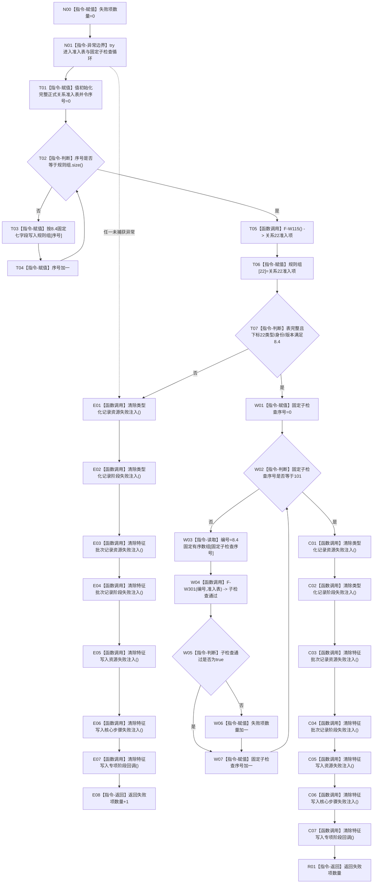

# F-W111 运行关系22与批次专项源码自检单函数施工流程图

更新时间：2026-07-29

## 函数合同

```text
根函数：std::uint32_t 运行节点直接特征关系22与批次专项源码自检() noexcept
归属：海中鱼巣.领域.自检.节点直接特征写入 /
海中鱼巣/领域/自检.节点直接特征写入.ixx / export
参数：无。
返回：详细设计 8.4/8.6 的101个固定子检查失败数量；覆盖主用例 W01—W39；全部通过返回0。
被调非平凡函数：F-W301；见 `流程图/20260729_NT-P2A_F-W301_执行关系22与批次专项子检查单函数施工流程图_v0.1.md`。
```

## 流程图



## 节点合同与边界

F-W111 只形成专项准入表、用 F-W115 唯一替换下标22并遍历固定101项数组；每个实际前态、变异、注入 / 回调、具名根调用、上下文读回、清除和快照比较全部由 F-W301 一次一项完成。异常与正常返回均清除本专项可见的全部 `thread_local` 状态。其它23项 allow-all 只属于夹具，不进入生产准入。
