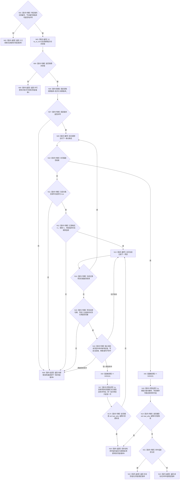

# F-W112 读取特征值批次引用组单函数施工流程图

更新时间：2026-07-29

## 函数合同

```text
根函数：
合同组结果<特征值批次引用值式材料>
节点直接特征批次记录只读访问器::读取特征值批次引用组(
    节点句柄 特征值) const

归属：海中鱼巣.领域.参与者.节点直接特征批次记录 /
海中鱼巣/领域/参与者.节点直接特征批次记录.ixx / public read-only
参数：特征值，值式完整句柄；本访问器只验证仓库编号、节点编号和版本号均非零，节点类型由持节点仓和结构读取许可的调用者复核。
返回：非空命中为成功/无/自有有序组/非零仓版本；
无命中为合法空组/无/空组/非零仓版本；
其它状态为空组/版本0。
```

## 流程图



## 节点合同

| 节点 | 类型 | 输入 | 输出 | 事实读写 | 验证 |
| --- | --- | --- | --- | --- | --- |
| N03 | 指令-操作 | 批次仓互斥 | 共享锁 | 取得只读仓许可 | W20 |
| N06 | 指令-赋值 | 仓结构版本 | 固定版本 | 只读批次仓 | W20/W21 |
| N09/N13 | 指令-循环 | 仓条目 / 项目组 | 当前元素 | 只读已发布记录 | W21/W22 |
| N11/N12/N15 | 指令-判断 | 仓条目和项目字段 | 完整性布尔 | 无写入 | W21/W22 |
| N17/N17A | 异常边界 / 判断 | 当前项目 | 自有引用副本或资源失败 | 仅调用栈结果 | W23 |
| N18/N19 | 异常边界 / 判断 | 命中组 | 稳定有序组或资源失败 | 仅调用栈结果 | W23 |
| 返回节点 | 指令-返回 | 具名分类 | 完整组结果 | 无半结构 | W20—W24 |

## 关键边界

```text
普通读取观察到任何未发布仓条目均为内部不一致，不能静默跳过。
合法空组仍回显同次批次仓非零结构版本。
“按特征值反查”覆盖项目中的两个历史角色：`项目.新特征值 == 输入` 或 `项目.写前当前值 == 输入`。同一项目恰一角色命中时只返回一份项目引用；两者同时命中属于批次账内部不一致。这样退役材料不会遗漏“该值曾作为换代写前值被 4170 账引用”的删除影响面。
本函数不读取节点、关系或类型化记录；F-R104 负责在结构读取许可内按命中角色完成跨仓互证。
本函数无法从节点句柄自身推导节点类型，不得产生错类型裁决或为此增加节点仓依赖。
```
