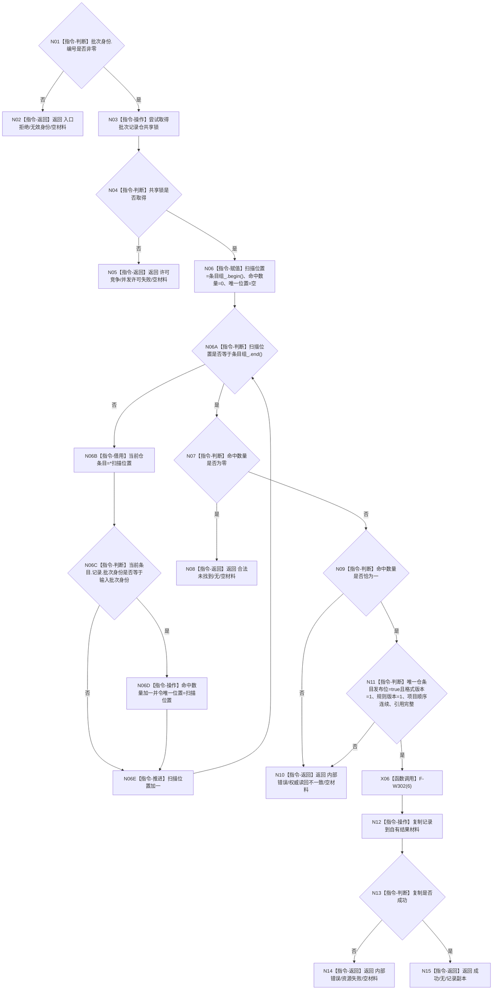

# F-W113 读取特征批次记录

更新时间：2026-07-29

## 依据

```text
规范/4170_子规范_特征批次发布记录与幂等账.md
规范/详细设计/NODE-TYPED-MIGRATION_NT-P2A_特征值类型化记录与当前关系迁移详细设计.md
```

## 身份与边界

本图是待新增函数的正式单函数施工流程图。只读取本域批次记录仓，不取得节点直接结构许可，不组合节点、关系、索引或类型化记录。

## 函数合同

```text
根函数：
节点直接特征批次记录读取结果
节点直接特征批次记录只读访问器::读取批次记录(
    节点直接特征批次身份 批次身份) const

归属模块 / 文件 / 层级：
海中鱼巣.领域.参与者.节点直接特征批次记录
海中鱼巣/领域/参与者.节点直接特征批次记录.ixx
public read-only 成员函数

参数：
批次身份，值式输入；编号必须非零。

返回：
成功/无/自有记录副本；
合法未找到/无/空材料；
入口拒绝/无效身份/空材料；
许可竞争/并发许可失败/空材料；
内部错误/权威读回不一致或资源失败/空材料。
```

## 流程图



## 节点合同

| 节点 | 类型 | 参数 / 输入绑定 | 结果 / 输出绑定 | 事实读写 | 后继条件 | 验证 |
| --- | --- | --- | --- | --- | --- | --- |
| N01 | 指令-判断 | `批次身份` | 非零布尔 | 无 | 是/否 | W17 |
| N03 | 指令-操作 | `批次记录仓.共享锁` | 锁取得结果 | 只读仓锁 | 完成 | W17 |
| N06 | 指令-读取 | `批次身份` -> 仓键 | 命中数量与唯一位置 | 只读批次记录仓 | 完成 | W17/W31 |
| N11 | 指令-判断 | 唯一记录 | 完整性布尔 | 无 | 是/否 | W18/W31 |
| N12 | 指令-操作 | 唯一记录 | 自有副本 | 无仓写入 | 成功/失败 | W31 |
| N02/N05/N08/N10/N14/N15 | 指令-返回 | 具名分类 | 完整结果 | 无 | 终止 | W17/W18/W31 |

## 关键边界

```text
F-W104 在事务外预读和普通执行器回调内锁内重检均调用本函数。
F-W110 先调用本函数取得批次账，再按账内四个关系句柄和发布后原始值版本形成历史投影；不得调用 F-W103。
本函数只取得批次仓共享锁；调用者不得在已经持有该仓独占锁时调用。
空材料结果不得携带候选、半结构或默认业务对象。
节点直接特征批次记录本体没有发布位；N11 只检查私有仓条目发布位。
```
