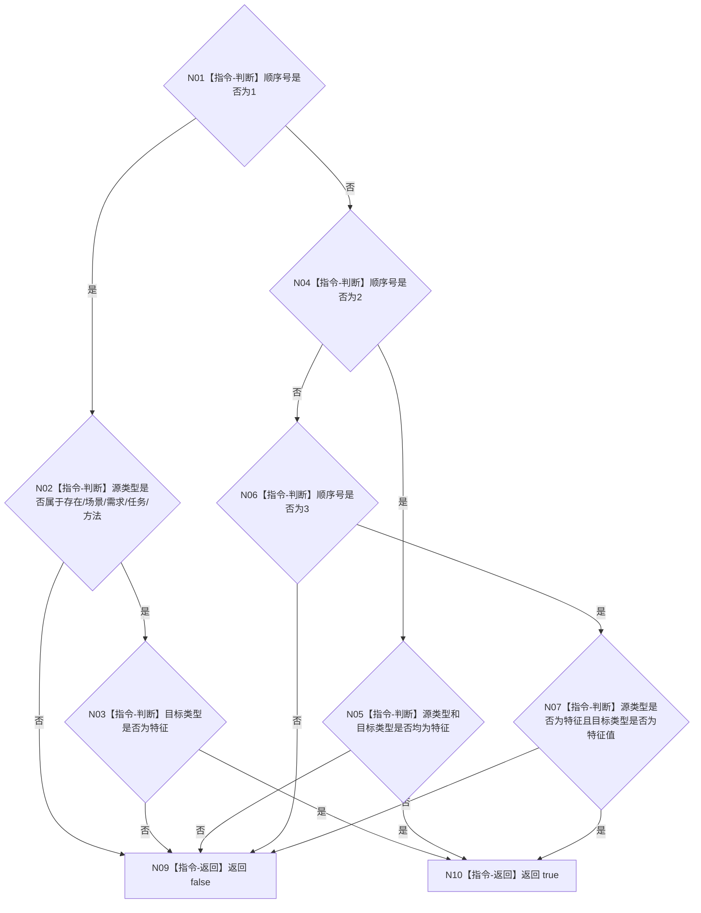

# F-W114 裁决关系 22 核心准入

更新时间：2026-07-29

## 身份与边界

正式待新增单函数施工流程图。只裁决核心端点类型与顺序号，不裁决完整句柄、命名域、角色基数或宿主定义唯一性。

## 函数合同

```text
根函数：
bool 节点直接特征关系22核心准入(
    节点类型 源类型,
    节点类型 目标类型,
    std::int64_t 顺序号) noexcept

归属：
海中鱼巣.领域.协议.节点直接特征关系准入
海中鱼巣/领域/协议.节点直接特征关系准入.ixx
export 自由纯值函数

返回：仅合同列明的三种角色端点组合返回 true；其它返回 false。
```

## 流程图



## 关键边界

```text
形成准入项的平凡工厂固定两个全局多重性为 true、重挂为 false。
逐角色基数和“同宿主同定义唯一槽”必须由 F-W101/F-W104 再裁决。
```
