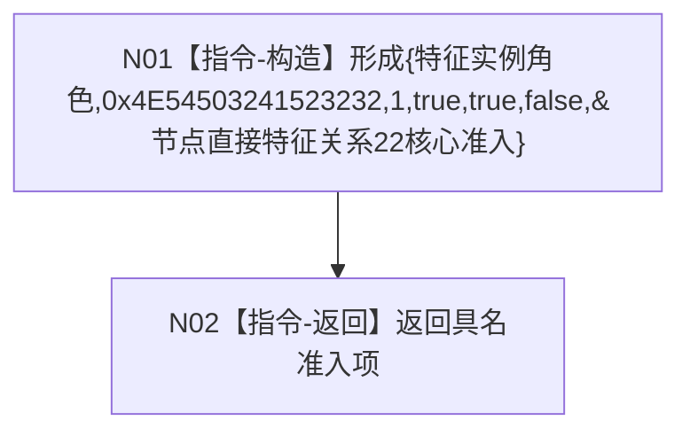

# F-W115 形成关系 22 核心准入项

根函数：`具名正式关系准入 形成节点直接特征关系22准入() noexcept`

归属：`海中鱼巣.领域.协议.节点直接特征关系准入` / `海中鱼巣/领域/协议.节点直接特征关系准入.ixx`；export 自由纯值函数。

节点合同：字段顺序和数值固定；不得复制裁决函数、改写多重性或返回完整准入表。#352 只把本结果放入完整表下标 22。
