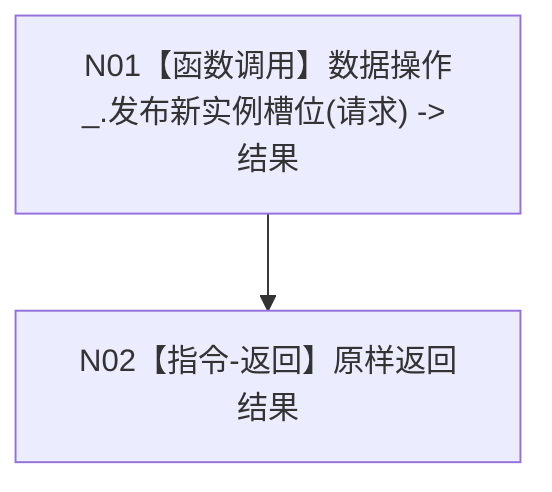

# F-W201 服务发布新实例槽位

根函数：`带值结构写入结果<实例特征槽位值式材料> 节点直接特征写入服务::发布新实例槽位(const 新实例槽位发布请求& 请求)`

归属：`海中鱼巣.领域.服务.节点直接特征写入` / `海中鱼巣/领域/服务.节点直接特征写入.ixx`；public 成员；请求只借用至返回，结果自有。

节点合同：`请求 -> 请求`，返回结果不转换状态、原因、材料或结构版本；服务不持仓、锁、许可或参与者。
