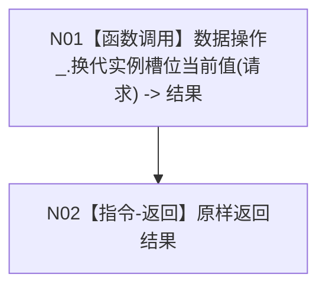

# F-W202 服务换代实例槽位当前值

根函数：`带值结构写入结果<实例特征槽位值式材料> 节点直接特征写入服务::换代实例槽位当前值(const 实例槽位当前值换代请求& 请求)`

归属：`海中鱼巣.领域.服务.节点直接特征写入` / `海中鱼巣/领域/服务.节点直接特征写入.ixx`；public 成员。

```mermaid
flowchart TD
 N01["N01【函数调用】数据操作_.换代实例槽位当前值(请求) -> 结果"] --> N02["N02【指令-返回】原样返回结果"]
```

节点合同：只借用请求和非空数据操作引用；不转换结果，不启动第二事务。
