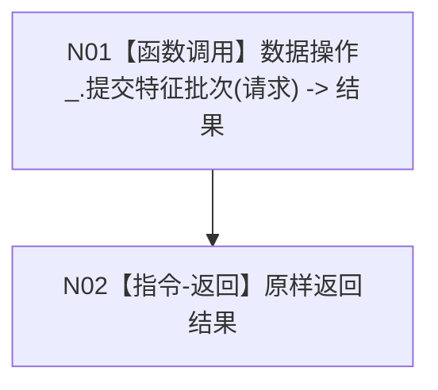

# F-W203 服务提交特征批次

根函数：`带值结构写入结果<特征批次提交值式材料> 节点直接特征写入服务::提交特征批次(const 特征批次变更请求& 请求)`

归属：`海中鱼巣.领域.服务.节点直接特征写入` / `海中鱼巣/领域/服务.节点直接特征写入.ixx`；public 成员。

```mermaid
flowchart TD
 N01["N01【函数调用】数据操作_.提交特征批次(请求) -> 结果"] --> N02["N02【指令-返回】原样返回结果"]
```

节点合同：保持项目顺序、材料和结构版本；不拆批、不启动子事务。
