# F-W301 执行关系22与批次专项子检查单函数施工流程图

更新时间：2026-07-29

## 函数合同

```text
根函数：bool 执行关系22与批次专项子检查(
    关系22与批次专项子检查编号 编号,
    const 完整正式关系准入表& 准入表) noexcept
归属：海中鱼巣.领域.自检.节点直接特征写入 /
海中鱼巣/领域/自检.节点直接特征写入.ixx / module-private
参数：编号按值；准入表调用期只读借用且下标22已由F-W115替换。
返回：一个固定子检查全部结果和快照一致返回true，否则false。
调用方：仅F-W111。
```

## 流程图

```mermaid
flowchart TD
 N00["N00【指令-异常边界】try 执行一个固定子检查"] --> N01{"N01【指令-判断】编号在8.4的101项表内且准入表完整"}
 N00 -. "任一异常" .-> E01["E01【函数调用】清除类型化记录资源失败注入()"]
 E01 --> E02["E02【函数调用】清除类型化记录阶段失败注入()"]
 E02 --> E03["E03【函数调用】清除特征批次记录资源失败注入()"]
 E03 --> E04["E04【函数调用】清除特征批次记录阶段失败注入()"]
 E04 --> E05["E05【函数调用】清除特征写入资源失败注入()"]
 E05 --> E06["E06【函数调用】清除特征写入核心步骤失败注入()"]
 E06 --> E07["E07【函数调用】清除特征写入专项阶段回调()"]
 E07 --> E08["E08【指令-返回】返回false"]
 N01 -- "否" --> E01
 N01 -- "是" --> N02["N02【指令-绑定】按编号从101项固定描述数组取得唯一 const 描述引用"]
 N02 --> C01["C01【函数调用】清除类型化记录资源失败注入()"]
 C01 --> C02["C02【函数调用】清除类型化记录阶段失败注入()"]
 C02 --> C03["C03【函数调用】清除特征批次记录资源失败注入()"]
 C03 --> C04["C04【函数调用】清除特征批次记录阶段失败注入()"]
 C04 --> C05["C05【函数调用】清除特征写入资源失败注入()"]
 C05 --> C06["C06【函数调用】清除特征写入核心步骤失败注入()"]
 C06 --> C07["C07【函数调用】清除特征写入专项阶段回调()"]
 C07 --> F01["F01【指令-构造】事务域"]
 F01 --> F02["F02【指令-构造】节点仓{0x5032A001}"]
 F02 --> F03["F03【指令-构造】关系仓{节点仓,准入表,0x5032A002}"]
 F03 --> F04["F04【指令-构造】索引仓{节点仓,关系仓}"]
 F04 --> F05["F05【指令-构造】执行器{&事务域,&节点仓,&关系仓,&索引仓}"]
 F05 --> F06["F06【指令-构造】记录仓"]
 F06 --> F07["F07【指令-构造】批次仓"]
 F07 --> F08["F08【指令-构造】写数据操作{事务域,节点仓,关系仓,索引仓,记录仓,批次仓}"]
 F08 --> F09["F09【指令-构造】写服务{写数据操作}"]
 F09 --> F10["F10【指令-构造】记录访问器{记录仓}"]
 F10 --> F11["F11【指令-构造】批次访问器{批次仓}"]
 F11 --> F12["F12【指令-构造】记录参与者{记录仓}"]
 F12 --> F13["F13【指令-构造】批次参与者{批次仓}"]
 F13 --> F14["F14【指令-构造】固定读探针参与者"]
 F14 --> B01["B01【函数调用】执行器.执行(本函数六基础节点回调) -> 基础结果"]
 B01 --> B02{"B02【指令-判断】基础结果和六完整句柄是否等于8.4"}
 B02 -- "否" --> E01
 B02 -- "是" --> P01["P01【指令-赋值】前态动作序号=0"]
 P01 --> P02{"P02【指令-判断】前态动作序号是否等于描述.前态动作组.size()"}
 P02 -- "否" --> P03{"P03【指令-判断】当前前态动作的公开写根"}
 P03 -- "F-W101" --> P04["P04【函数调用】写数据操作.发布新实例槽位(动作.请求) -> 前态结果"]
 P03 -- "F-W102" --> P05["P05【函数调用】写数据操作.换代实例槽位当前值(动作.请求) -> 前态结果"]
 P03 -- "F-W104" --> P06["P06【函数调用】写数据操作.提交特征批次(动作.请求) -> 前态结果"]
 P04 --> P07
 P05 --> P07
 P06 --> P07["P07【指令-判断】前态结果是否逐字段等于动作.预期"]
 P07 -- "否" --> E01
 P07 -- "是" --> P08["P08【指令-赋值】前态动作序号加一"]
 P08 --> P02
 P02 -- "是" --> S01["S01【函数调用】节点仓.导出权威状态() -> 前节点权威材料"]
 S01 --> S02["S02【函数调用】关系仓.读取全部关系审计() -> 前关系快照"]
 S02 --> S03["S03【函数调用】索引仓.导出可丢弃加速材料() -> 前索引快照"]
 S03 --> S04["S04【函数调用】记录访问器.读取结构版本() -> 前记录版本"]
 S04 --> S04A{"S04A【指令-判断】描述.快照批次身份是否有值"}
 S04A -- "是" --> S05["S05【函数调用】批次访问器.读取批次记录(*描述.快照批次身份) -> 前批次快照"]
 S04A -- "否" --> S05A["S05A【指令-赋值】前批次快照=nullopt"]
 S05A --> I01
 S05 --> I01{"I01【指令-判断】描述.注入种类"}
 I01 -- "类型化资源" --> I02["I02【函数调用】设置类型化记录资源失败注入(点,1)"]
 I01 -- "类型化阶段" --> I03["I03【函数调用】设置类型化记录阶段失败注入(点)"]
 I01 -- "批次资源" --> I04["I04【函数调用】设置特征批次记录资源失败注入(点,1)"]
 I01 -- "批次阶段" --> I05["I05【函数调用】设置特征批次记录阶段失败注入(点)"]
 I01 -- "写入资源" --> I06["I06【函数调用】设置特征写入资源失败注入(点,1)"]
 I01 -- "核心步骤" --> I07["I07【函数调用】设置特征写入核心步骤失败注入(点,固定核心结果)"]
 I01 -- "阶段回调" --> I08["I08【指令-赋值】上下文.阶段回调配方=描述.阶段回调配方"]
 I08 --> I09["I09【函数调用】设置特征写入专项阶段回调(1,&F-W310,&上下文)"]
 I09 --> D00
 I01 -- "无" --> D00
 I02 --> D00
 I03 --> D00
 I04 --> D00
 I05 --> D00
 I06 --> D00
 I07 --> D00["D00【指令-构造】按描述.参与者组配方形成局部数组/span；局部lambda唯一指令为F-W309(描述.回调配方,上下文,会话)"]
 D00 --> D01{"D01【指令-判断】描述.目标根"}
 D01 -- "F-W114" --> T01["T01【函数调用】F-W114(描述.源类型,目标类型,顺序) -> 目标结果"]
 D01 -- "F-W115" --> T02["T02【函数调用】F-W115() -> 目标结果"]
 D01 -- "F-W101" --> T03["T03【函数调用】写数据操作.发布新实例槽位(描述.请求) -> 目标结果"]
 D01 -- "F-W102" --> T04["T04【函数调用】写数据操作.换代实例槽位当前值(描述.请求) -> 目标结果"]
 D01 -- "F-W104" --> T05["T05【函数调用】写数据操作.提交特征批次(描述.请求) -> 目标结果"]
 D01 -- "F-W105/执行器阶段" --> T06["T06【函数调用】执行器.执行(局部事务lambda,局部参与者span) -> 目标结果"]
 D01 -- "F-W112" --> T07["T07【函数调用】批次访问器.读取特征值批次引用组(描述.值) -> 目标结果"]
 D01 -- "F-W113" --> T08["T08【函数调用】批次访问器.读取批次记录(描述.批次身份) -> 目标结果"]
 D01 -- "F-W110" --> T09["T09【函数调用】写数据操作.读取特征批次发布结果(描述.批次身份) -> 目标结果"]
 D01 -- "F-W201" --> T10["T10【函数调用】写服务.发布新实例槽位(描述.请求) -> 目标结果"]
 D01 -- "F-W202" --> T11["T11【函数调用】写服务.换代实例槽位当前值(描述.请求) -> 目标结果"]
 D01 -- "F-W203" --> T12["T12【函数调用】写服务.提交特征批次(描述.请求) -> 目标结果"]
 T01 --> G01
 T02 --> G01
 T03 --> G01
 T04 --> G01
 T05 --> G01
 T06 --> G01
 T07 --> G01
 T08 --> G01
 T09 --> G01
 T10 --> G01
 T11 --> G01
 T12 --> G01["G01【指令-读取】读取可选阶段上下文结果/未知异常标记"]
 G01 --> C08["C08【函数调用】清除类型化记录资源失败注入()"]
 C08 --> C09["C09【函数调用】清除类型化记录阶段失败注入()"]
 C09 --> C10["C10【函数调用】清除特征批次记录资源失败注入()"]
 C10 --> C11["C11【函数调用】清除特征批次记录阶段失败注入()"]
 C11 --> C12["C12【函数调用】清除特征写入资源失败注入()"]
 C12 --> C13["C13【函数调用】清除特征写入核心步骤失败注入()"]
 C13 --> C14["C14【函数调用】清除特征写入专项阶段回调()"]
 C14 --> S06["S06【函数调用】节点仓.导出权威状态() -> 后节点权威材料"]
 S06 --> S07["S07【函数调用】关系仓.读取全部关系审计() -> 后关系快照"]
 S07 --> S08["S08【函数调用】索引仓.导出可丢弃加速材料() -> 后索引快照"]
 S08 --> S09["S09【函数调用】记录访问器.读取结构版本() -> 后记录版本"]
 S09 --> S09A{"S09A【指令-判断】描述.快照批次身份是否有值"}
 S09A -- "是" --> S10["S10【函数调用】批次访问器.读取批次记录(*描述.快照批次身份) -> 后批次快照"]
 S09A -- "否" --> S10A["S10A【指令-赋值】后批次快照=nullopt"]
 S10A --> V01
 S10 --> V01{"V01【指令-判断】目标结果、上下文标记和探针计数逐字段等于预期"}
 V01 -- "否" --> R02["R02【指令-返回】返回false"]
 V01 -- "是" --> V02["V02【指令-赋值】材料种类=节点、向量位置=0"]
 V02 --> V03{"V03【指令-判断】当前前后材料标量字段与预期相等且向量大小相等"}
 V03 -- "否" --> R02
 V03 -- "是" --> V04{"V04【指令-判断】向量位置是否等于当前向量大小"}
 V04 -- "否" --> V05["V05【指令-借用】当前实际元素和预期元素"]
 V05 --> V06{"V06【指令-判断】元素全部字段递归相等"}
 V06 -- "否" --> R02
 V06 -- "是" --> V07["V07【指令-推进】向量位置加一"]
 V07 --> V04
 V04 -- "是" --> V08{"V08【指令-判断】是否已比较节点、关系、索引三类向量"}
 V08 -- "否" --> V09["V09【指令-推进】切换下一材料种类并把向量位置置0"]
 V09 --> V03
 V08 -- "是" --> V10{"V10【指令-判断】记录版本和optional批次前后存在性、值全部字段等于预期"}
 V10 -- "否" --> R02
 V10 -- "是" --> R01["R01【指令-返回】返回true"]

 subgraph CB["本函数六基础节点回调"]
  B11["B11【函数调用】会话.创建节点候选(场景,场景身份1) -> 宿主"] --> B12["B12【函数调用】会话.创建节点候选(特征,抽象特征定义身份1) -> 定义甲"]
  B12 --> B13["B13【函数调用】会话.创建节点候选(特征,抽象特征定义身份2) -> 定义乙"]
  B13 --> B14["B14【函数调用】会话.创建节点候选(状态,状态身份1) -> 来源甲"]
  B14 --> B15["B15【函数调用】会话.创建节点候选(状态,状态身份2) -> 来源乙"]
  B15 --> B16["B16【函数调用】会话.创建节点候选(特征,实例特征槽身份1) -> 错命名域特征"]
  B16 --> B17{"B17【指令-判断】六结果均为已形成候选且完整句柄逐字段等于8.4"}
  B17 -- "是" --> B18["B18【函数调用】会话.请求提交()"]
  B17 -- "否" --> B19["B19【函数调用】会话.请求撤销()"]
 end
```



## 关键边界

8.4 的101项固定描述逐项冻结前态动作、唯一目标根、完整输入、可选注入、上下文和预期；一个调用不遍历下一项。基础节点回调由本图 B11—B19 完整定义并逐字段核对，不跨文档引用局部 subgraph，也不以实际返回重写预期。T06 的固定 span 只允许 `{&批次参与者}`、`{&批次参与者,&固定读探针参与者}` 或 8.4 明列的阶段探针组合，构造和前态登记都来自描述，不临时选择。W38 的批次资源点1—6和写入点7—15目标为 F-W104；写入点16—20的描述目标固定为 F-W101，并分别使用 W15/W16 前态使 private F-W103 可达。业务 F-W104 的参与者数组固定 `{&记录参与者,&批次参与者}`；专项 T06 不冒充该业务数组。
