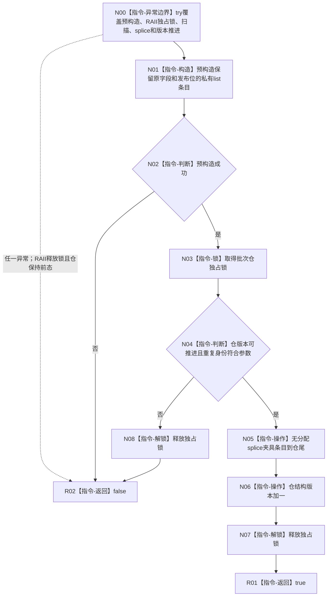

# F-W304 专项插入特征批次仓夹具条目单函数施工流程图

- 根函数：`bool 专项插入特征批次仓夹具条目(节点直接特征批次记录仓& 仓, const 节点直接特征批次记录& 记录, bool 已发布, bool 允许重复批次身份) noexcept`
- 物理位置：`海中鱼巣/领域/参与者.节点直接特征批次记录.ixx`，专项宏开启 export

```mermaid
flowchart TD
 N00["N00【指令-异常边界】try覆盖预构造、RAII独占锁、扫描、splice和版本推进"] --> N01["N01【指令-构造】预构造保留原字段和发布位的私有list条目"]
 N00 -. "任一异常；RAII释放锁且仓保持前态" .-> R02["R02【指令-返回】false"]
 N01 --> N02{"N02【指令-判断】预构造成功"}
 N02 -->|否| R02["R02【指令-返回】false"]
 N02 -->|是| N03["N03【指令-锁】取得批次仓独占锁"]
 N03 --> N04{"N04【指令-判断】仓版本可推进且重复身份符合参数"}
 N04 -->|否| N08["N08【指令-解锁】释放独占锁"]
 N08 --> R02
 N04 -->|是| N05["N05【指令-操作】无分配splice夹具条目到仓尾"]
 N05 --> N06["N06【指令-操作】仓结构版本加一"]
 N06 --> N07["N07【指令-解锁】释放独占锁"]
 N07 --> R01["R01【指令-返回】true"]
```
