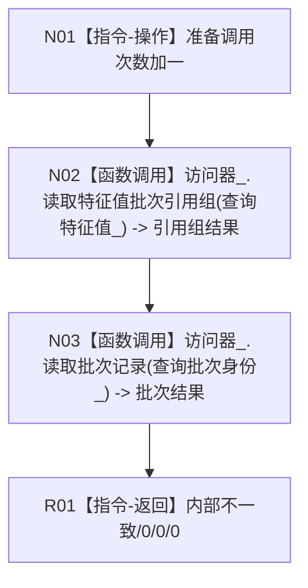

# F-W305 批次读取专项探针准备提交单函数施工流程图

- 根函数：`节点直接身份结构写入结果 批次读取专项探针参与者::准备提交(const 节点直接身份结构提交准备只读视图&)`
- 物理位置：`海中鱼巣/领域/自检.节点直接特征写入.ixx`，module-private override

```mermaid
flowchart TD
 N01["N01【指令-操作】准备调用次数加一"] --> N02["N02【函数调用】访问器_.读取特征值批次引用组(查询特征值_) -> 引用组结果"]
 N02 --> N03["N03【函数调用】访问器_.读取批次记录(查询批次身份_) -> 批次结果"]
 N03 --> R01["R01【指令-返回】内部不一致/0/0/0"]
```
