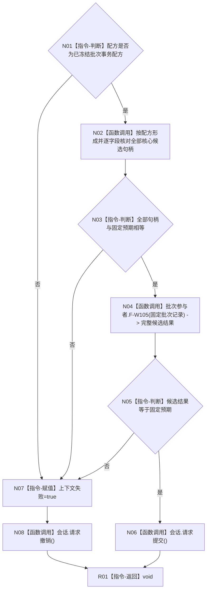

# F-W309 执行特征写入专项事务回调单函数施工流程图

- 根函数：`void 执行特征写入专项事务回调(专项回调配方 配方, 关系22与批次专项执行上下文& 上下文, 节点直接身份结构写入会话& 会话)`
- 物理位置：`海中鱼巣/领域/自检.节点直接特征写入.ixx`，module-private

```mermaid
flowchart TD
 N01{"N01【指令-判断】配方是否为已冻结批次事务配方"} -->|否| N07["N07【指令-赋值】上下文失败=true"]
 N01 -->|是| N02["N02【函数调用】按配方形成并逐字段核对全部核心候选句柄"]
 N02 --> N03{"N03【指令-判断】全部句柄与固定预期相等"}
 N03 -->|否| N07
 N03 -->|是| N04["N04【函数调用】批次参与者.F-W105(固定批次记录) -> 完整候选结果"]
 N04 --> N05{"N05【指令-判断】候选结果等于固定预期"}
 N05 -->|否| N07
 N05 -->|是| N06["N06【函数调用】会话.请求提交()"]
 N06 --> R01["R01【指令-返回】void"]
 N07 --> N08["N08【函数调用】会话.请求撤销()"]
 N08 --> R01
```
