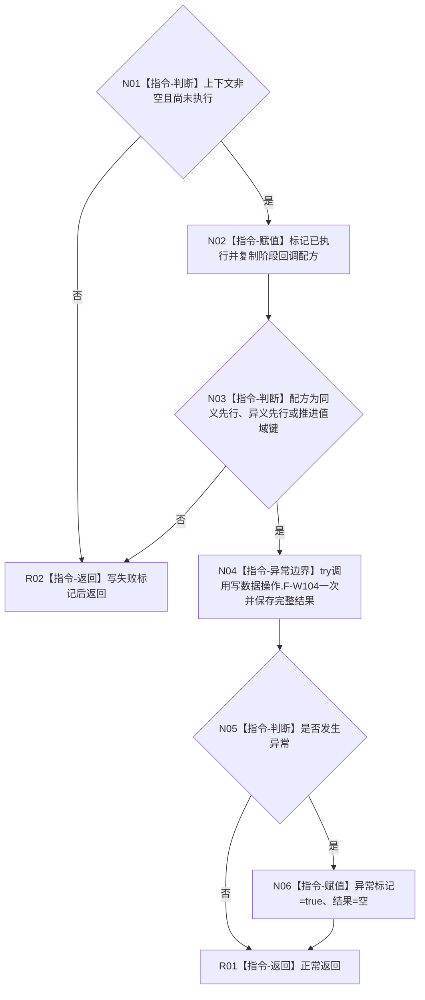

# F-W310 执行特征写入专项阶段回调单函数施工流程图

- 根函数：`void 执行特征写入专项阶段回调(void* 上下文) noexcept`
- 物理位置：`海中鱼巣/领域/自检.节点直接特征写入.ixx`，module-private

```mermaid
flowchart TD
 N01{"N01【指令-判断】上下文非空且尚未执行"} -->|否| R02["R02【指令-返回】写失败标记后返回"]
 N01 -->|是| N02["N02【指令-赋值】标记已执行并复制阶段回调配方"]
 N02 --> N03{"N03【指令-判断】配方为同义先行、异义先行或推进值域键"}
 N03 -->|否| R02
 N03 -->|是| N04["N04【指令-异常边界】try调用写数据操作.F-W104一次并保存完整结果"]
 N04 --> N05{"N05【指令-判断】是否发生异常"}
 N05 -->|是| N06["N06【指令-赋值】异常标记=true、结果=空"]
 N05 -->|否| R01["R01【指令-返回】正常返回"]
 N06 --> R01
```
