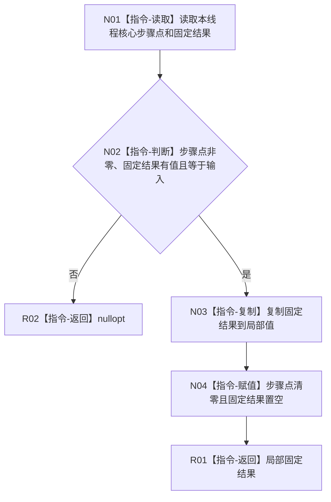

# F-W312 取得特征写入核心步骤失败注入单函数施工流程图

- 根函数：`std::optional<节点直接身份结构写入结果> 取得特征写入核心步骤失败注入(std::uint16_t 步骤点) noexcept`
- 物理位置：`海中鱼巣/领域/数据操作.节点直接特征写入.ixx`，module-private，专项宏开启

```mermaid
flowchart TD
 N01["N01【指令-读取】读取本线程核心步骤点和固定结果"] --> N02{"N02【指令-判断】步骤点非零、固定结果有值且等于输入"}
 N02 -->|否| R02["R02【指令-返回】nullopt"]
 N02 -->|是| N03["N03【指令-复制】复制固定结果到局部值"]
 N03 --> N04["N04【指令-赋值】步骤点清零且固定结果置空"]
 N04 --> R01["R01【指令-返回】局部固定结果"]
```
