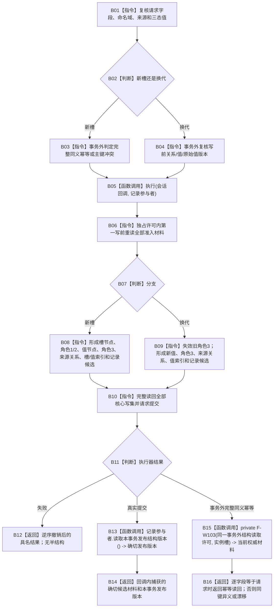

# NT-P2A 关系22单槽生命周期业务流程图

更新时间：2026-07-29

## 依据与身份

正式目标业务流程图。依据：2100 v0.6、4010、4020、4030、4040、4050、4110 v0.5。

业务闭环：新实例槽初始发布，或已有实例槽当前值换代。两条分支都在一个节点直接结构事务中共同确认、撤销和发布节点、关系 22、来源关系、可重建物理索引和类型化记录。索引只按稳定主键形成确定物理定位，命中后仍回读权威节点、关系和记录。

## 流程图

## 业务节点—能力—函数映射

| 节点 | 所需能力 | 复用 / 新建 | 目标函数组 |
| --- | --- | --- | --- |
| B01—B04 | 请求、幂等和写前复核 | 新建 P2A-WRITE/v1 | F-W101、F-W102 |
| B05、B10—B12 | 核心结构 + 记录参与者原子事务 | 直接复用现行执行器 | F-W101、F-W102 |
| B08 | 新槽关系 22 生命周期 | 新建 | F-W101 |
| B09 | 当前值换代与旧关系审计 | 新建 | F-W102 |
| B13—B14 | 真实提交的确切候选材料与版本 | 新建记录参与者回显 | F-A110、F-W101、F-W102 |
| B15—B16 | 幂等分支当前完整投影 | 新建内部读取 | F-W103 |

## 完成与非成功边界

- 新槽不得先发布空槽；角色 1、2、3 与值记录必须同一事务。
- 换代不得原地重挂旧角色 3；必须失效旧关系并新建当前关系。
- 完整同义重复返回幂等读回；部分主键占用、同键异义或写前漂移均零写入。
- 真实提交禁止在释放独占许可后再读取“当前槽”证明本次事务；只返回回调内捕获材料和 F-A110 确切版本。F-W103 是写数据操作 private 组合读取，只服务 F-W101/F-W102 的幂等与结构异常分类，不形成公开读取 ABI。
- 前置通过后的候选、阶段、撤销、发布或读回矛盾为内部错误。
