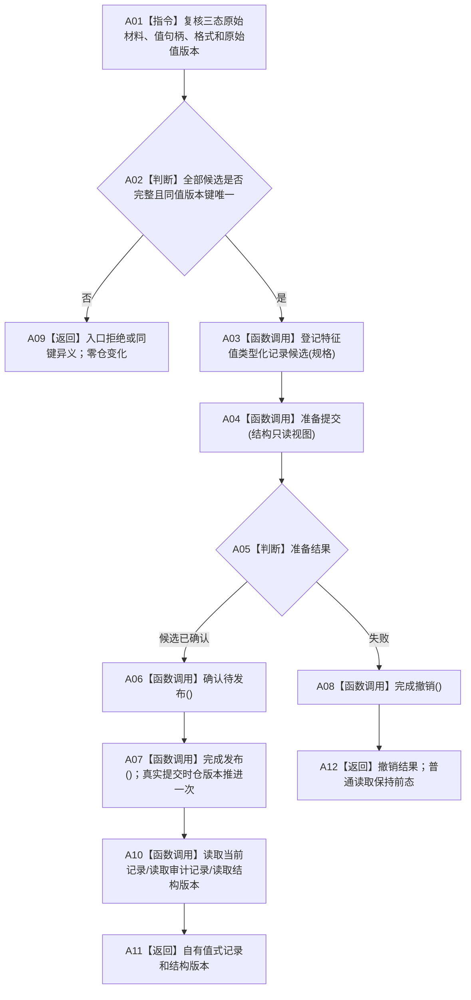

# NT-P2A 类型化记录基础业务流程图

更新时间：2026-07-29

## 依据与身份

正式目标业务流程图。依据：2100 v0.6、4010、4020、4040、4050、4110 v0.5、4170 v0.5。

业务闭环：接收一组特征值类型化记录候选，在节点直接结构事务的参与者阶段完成准备、确认、发布或逆序撤销，并提供自有值式当前 / 审计读取。该闭环不创建节点、关系、索引或 4170 记录，不宣称实例槽业务能力完成。

## 输入、输出和完成条件

```text
输入：一个事务内按登记顺序形成的 1..N 条特征值类型化记录规格
输出：强类型参与者结果、发布后当前 / 审计记录副本、非零投影结构版本
成功：全部规格共同发布，仓结构版本只推进一次
逻辑内返回：入口拒绝、许可竞争、幂等读回
内部错误：重复异义、节点身份不一致、阶段错误、发布后读回不一致
```

## 流程图



## 业务节点—能力—函数映射

| 节点 | 所需能力 | 复用 / 新建 | 目标函数组 |
| --- | --- | --- | --- |
| A01—A03 | 三态校验和多候选登记 | 新建；旧原始材料参与者不可复用 | F-A101 |
| A04—A08 | 4040 参与者四阶段 | 复用核心基类；新建领域参与者 | F-A102—F-A105 |
| A07 | 一事务一次版本推进 | 新建记录仓规则 | F-A104 |
| A10—A11 | 当前 / 审计 / 空组版本值式读取 | 新建 | F-A106、F-A107、F-A109 |

## 关键边界

- 记录只保存值身份、格式、原始值版本、状态和三态原始值；关系端点与批次字段零进入。
- `结构完整` 接受已发布的有效 / 已失效 / 已删除版本；`可作当前读取` 只接受有效最新版本。
- `完成发布() noexcept` 只关闭撤销能力、推进一次版本并释放仓占用，不分配、不记录日志、不调用外部函数。
