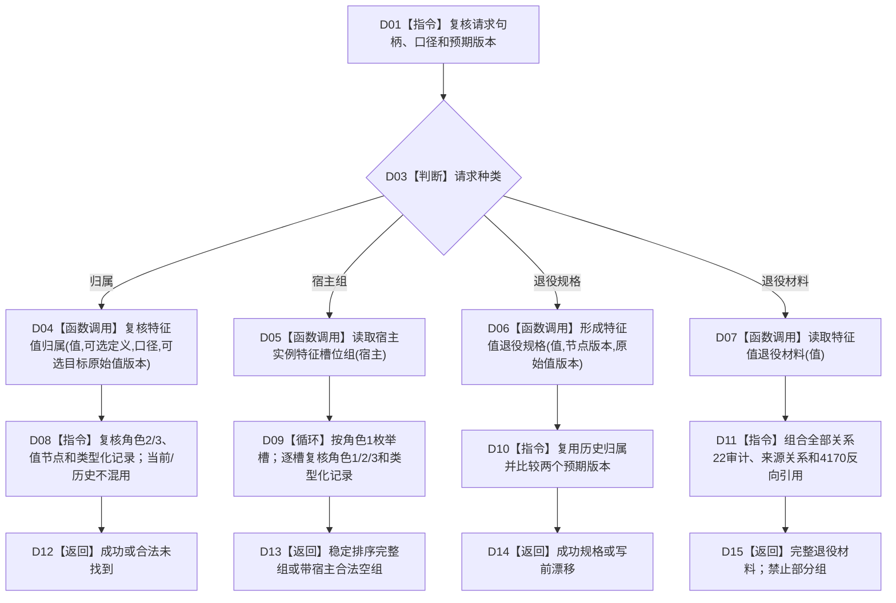

# NT-P2A 跨域读取与退役投影业务流程图

更新时间：2026-07-29

## 依据与身份

正式目标业务流程图。依据：2100 v0.6、4010、4020、4030、4050、4110 v0.5、4170 v0.5、NT-C2/v0.5。

业务闭环：在一次节点直接结构读取许可内组合节点、关系 22、来源关系、类型化记录和本域 4170，自有值式返回归属、宿主槽位组、退役规格或退役材料；不持久化投影。

## 流程图

## 业务节点—能力—函数映射

| 节点 | 所需能力 | 复用 / 新建 | 目标函数组 |
| --- | --- | --- | --- |
| D04—D07 | 每个所选根内部唯一取得一次同域结构读取许可 | 复用核心读取许可；禁止调用方预先持许可 | F-R101—F-R104 |
| D04、D08 | 当前 / 历史归属 | 新建 | F-R101 |
| D05、D09 | 宿主槽位完整组 | 新建；复用正式关系正向读取 | F-R102 |
| D06、D10 | 强类型退役规格 | 新建 | F-R103 |
| D07、D11 | 关系 / 批次退役审计 | 新建；消费 P2A-WRITE 本域账 | F-R104 |

## 结果边界

- 当前口径不接受失效关系；历史口径不得重新解释为当前。
- 当前口径的目标原始值版本必须为空；历史口径必须显式携带非零目标原始值版本，并从同一值的完整历史记录组中恰一选择。
- 一次服务调用只选择一个 F-R101—F-R104 根；所选根内部唯一取得一次读取许可。服务和业务编排不得先取得许可再调用会自行取许可的根。
- 合法无匹配返回 `合法未找到`；合法宿主无槽返回带宿主身份的 `合法空组`。
- 多宿主、多模板、多当前值、悬空端点、记录 / 关系 / 批次不一致为内部错误，全部材料为空。
