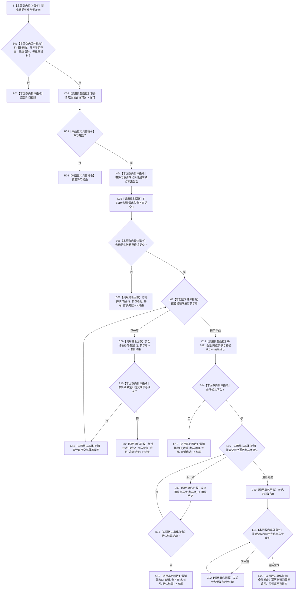

# SAFETY-P1-PROVIDER F-S109 执行仅参与者事务单函数施工流程图 v0.1

日期：2026-07-29

函数身份：F-S109

归属模块 / 文件：`海中鱼巣.核心.执行器.节点直接身份结构写入` / `海中鱼巣/核心/执行器.节点直接身份结构写入.ixx`

完整签名：

```cpp
节点直接身份结构写入结果
节点直接身份结构写入执行器::执行仅参与者事务(
    std::span<节点直接身份结构写入事务参与者* const> 参与者组) const;
```

返回结果：`节点直接身份结构写入结果`



## 节点合同

| 节点 | 类型 | 输入 / 输出 | 事务与失败 | 验证 |
| --- | --- | --- | --- | --- |
| B01 | 本函数内具体指令 | 非拥有 span | 空组、空指针、重复对象写前拒绝 | CORE-A01—A03 |
| C02—C05 | 被调函数 / 指令 | 唯一许可、零核心写集会话、仅参与者提交决定 | 不暴露会话给调用方 | CORE-A04 |
| C09—N11 | 被调函数 / 指令 | 准备结果和幂等聚合 | 非法成功状态按内部不一致撤销 | CORE-A05—A08 |
| C13—C19 | 被调函数 / 指令 | 空会话确认、参与者顺序确认 | 任一点失败逆序撤销全部登记参与者和空会话 | CORE-A06—A09 |
| C20—C22 | 被调函数 | 空会话发布、参与者最后发布 | 无失败区；许可覆盖到全部发布完成 | CORE-A10 |
| R23 | 本函数内具体指令 | `幂等读回` 或 `已提交` | 混合幂等和新候选按已提交 | CORE-A07/A11 |

调用方拥有参与者；span 不逃逸。函数不得取得业务仓库、生成候选、执行回调或允许普通入口提交空核心写集。
