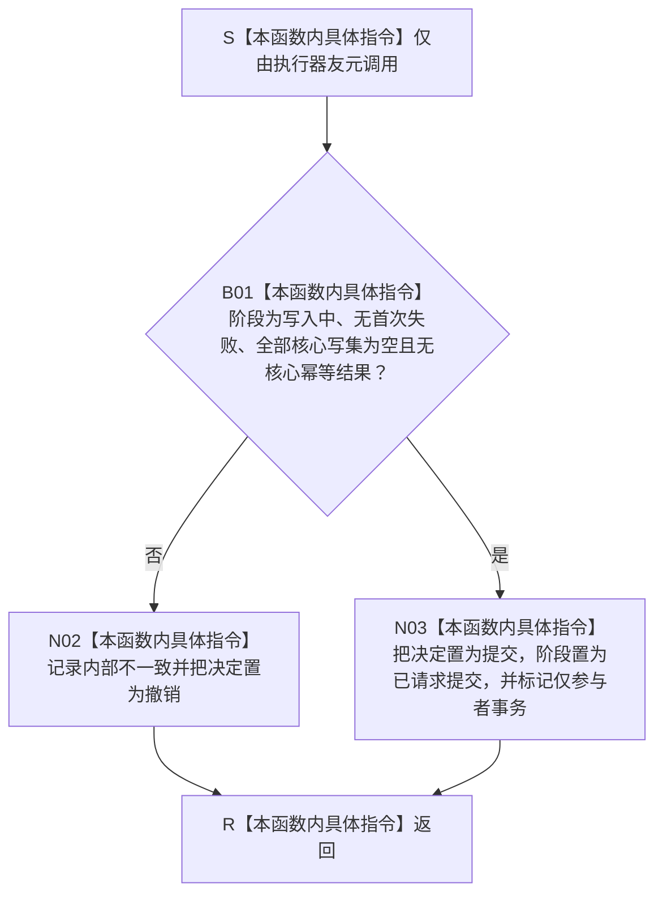

# SAFETY-P1-PROVIDER F-S110 请求仅参与者提交单函数施工流程图 v0.1

日期：2026-07-29

函数身份：F-S110

归属模块 / 文件：`海中鱼巣.核心.会话.节点直接身份结构写入` / `海中鱼巣/核心/会话.节点直接身份结构写入.ixx`

完整签名：

```cpp
void 节点直接身份结构写入会话::请求仅参与者提交() noexcept;
```

返回结果：`void`



本函数不公开、不接收参与者、不改变任何仓库。普通 `请求提交()` 的空写集拒绝合同保持不变。
